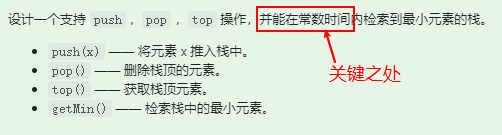

# 0. 数据结构

[数组与字符串](https://leetcode-cn.com/leetbook/detail/array-and-string/)—>[队列和栈](https://leetcode-cn.com/leetbook/detail/queue-stack/)—>[链表](https://leetcode-cn.com/leetbook/detail/linked-list/) —> [二叉树](https://leetcode-cn.com/leetbook/detail/data-structure-binary-tree/)

# 1. Array 

## 实战题目

-  https://leetcode-cn.com/problems/container-with-most-water/   （最大水面积）


```java
class Solution { //java实现
    public int maxArea(int[] height) {
        //最大水容量，双指针
        if (height == null || height.length==0) {
            return 0;
        }
        int max_area = 0;
        int area = 0;
        int j = height.length-1;
        for (int i = 0; i < j; i++) {//当不考虑i逐步递进时，可以考虑使用while循环！！！
            //i指头，j指尾
            area = (j-i) * Math.min(height[i],height[j]);
            //前边的大，则后边指针j前移
            if (height[i]>=height[j]) {
                i--; //保证i指针不后移
                j--; //确保j指针向前移
            }
            max_area = Math.max(max_area, area);

        }

        return max_area;
    }
}
```


-  https://leetcode-cn.com/problems/move-zeroes/

```java
//java
class Solution {
    public void moveZeroes(int[] nums)  {
        int length;
        if (nums == null || (length = nums.length) == 0) {
            return;
        }
        int j = 0;
        for (int i = 0; i < length; i++) {
            //i进行后续探索，j进行延后的定位，始终指向下一个存储位置
            if (nums[i] != 0) {//非0，则进行交换
                if (i > j) {
                    nums[j] = nums[i];
                    nums[i] = 0;
                }
                j++;
            }
        }
    }
}
```

-  https://leetcode.com/problems/climbing-stairs/

```java
//java
class Solution {  //斐波那契数列
    protected int climbStairs(int n) {
        int f1 = 1;
        int f2 = 2;
        int f3 = 0;
        if (1==n){
            return f1;
        }else if (2==n){
            return f2;
        }
        for (int i = 2; i < n; i++) {
            f3 = f1 + f2;
            f1 = f2;
            f2 = f3;
        }

        return f2;
    }
}
```


-  [https://leetcode-cn.com/problems/two-sum/](https://leetcode-cn.com/problems/two-sum/)  (两数之和)

```java
//java
class Solution {
    //数组中同一个元素不能使用两遍: 没有重复元素，且不能输出相同的下标。最终要返回两个下标
    public int[] twoSum(int[] nums, int target) {//对于返回下标的题可以考虑HashMap
        if (nums == null || nums.length == 0){
            return null;
        }

        HashMap<Integer, Integer> map = new HashMap<>(); //存储nums[i],i
        int tmp = 0;
        for (int i = 0; i < nums.length; i++) {
            tmp = target-nums[i];
            if (map.containsKey(tmp)){
                return new int[]{i,map.get(tmp)};
            }
            map.put(nums[i],i);
        }
        return null;
    }
}
class Solution3 { //66ms 39.9M
    //数组中同一个元素不能使用两遍: 没有重复元素，且不能输出相同的下标。最终要返回两个下标
    public int[] twoSum(int[] nums, int target) {//对于返回下标的题可以考虑
        if (nums == null || nums.length == 0){
            return new int[0];
        }
        int[] arr = new int[2];
        for (int i = 0; i < nums.length-1; i++) {
            for (int j = i+1; j < nums.length; j++) {
                if (nums[i]+nums[j] == target){
                    arr[0] = i;
                    arr[1] = j;
                    return arr;
                }
            }
            
        }

        return new int[0];
    }
}
```


-  [https://leetcode-cn.com/problems/3sum/ ](https://leetcode-cn.com/problems/3sum/)(高频老题） 

```java
//java
class Solution4 {
    public List<List<Integer>> threeSum(int[] nums) {
        //注意：答案中不可以包含重复的三元组。需要排序处理
        //非返回索引，可以排序
        List<List<Integer>> lists = new ArrayList<>();
        if (nums == null || nums.length<3) {
            return lists;
        }
        Arrays.sort(nums);


        //法1：暴力求解
        /*HashSet<List<Integer>> hashSet = new HashSet<>();
        for (int i = 0; i < nums.length-2; i++) {
            for (int j = i+1; j < nums.length-1; j++) {
                for (int k = j+1; k < nums.length; k++) {
                    if (nums[i] + nums[j] + nums[k] == 0){
                        ArrayList<Integer> list = new ArrayList<>();
                        list.add(nums[i]);
                        list.add(nums[j]);
                        list.add(nums[k]);
                        hashSet.add(list);
                    }
                }
            }
        }
        for (List<Integer> list: hashSet) {
            lists.add(list);
        }*/
        //法2：三指针
        for (int i = 0; i < nums.length; i++) {
            //判断首位，首位大于0，则没有满足的
            if (nums[i] > 0) {
                break;
            }
            //
            if (i > 0 && nums[i] == nums[i-1]) {
                continue;
            }
            int L = i+1;
            int R = nums.length-1;
            while (L< R){
                //进行判断
                int sum = nums[i] + nums[L] + nums[R];
                if (sum == 0){
                    lists.add(Arrays.asList(nums[i],nums[L],nums[R]));
                    //分别去重
                    while(L<R && nums[L]==nums[L+1]) L++;
                    while (R>L && nums[R]==nums[R-1]) R--;
                    //去重之后，再移一位
                    L++;
                    R--;
                }else if (sum < 0){
                    L++;
                }else if (sum>0){
                    R--;
                }
            }
        }
        return lists;
    }
}
```

# 2. Linked List 

## 实战题目

· https://leetcode.com/problems/reverse-linked-list/


```java
class Solution {//画个图就出来了
    public ListNode reverseList(ListNode head) {
        ListNode cur = null;
        ListNode pre = head;
        while (pre != null){
            ListNode tmp = pre.next; //探索者
            pre.next = cur;
            cur = pre;
            pre = tmp;
        }
        return cur;
    }
}

//递归的方式
```

· https://leetcode.com/problems/swap-nodes-in-pairs

```java
class Solution {
    public ListNode swapPairs(ListNode head) { //实际上使用了四个指针
        ListNode pre = new ListNode(0);
        pre.next = head;
        ListNode temp = pre;
        while(temp.next != null && temp.next.next != null) {  //头插法
            ListNode start = temp.next;
            ListNode end = temp.next.next;
            temp.next = end;
            start.next = end.next;
            end.next = start;
            temp = start;
        }
        return pre.next;
    }
}
```


· https://leetcode.com/problems/linked-list-cycle  

```java
public class Solution {
    public boolean hasCycle(ListNode head) {
        if (head == null) {
            return false;
        }
        HashSet<ListNode> hashSet = new HashSet<>();

        while (hashSet.add(head)){
            head = head.next;
            if (head == null){
                return false;
            }
        }
		
        return true;
    }
}
```


· https://leetcode.com/problems/linked-list-cycle-ii

```java
class Solution2 {
    public ListNode detectCycle(ListNode head) {
        ListNode fast = head, slow = head;
        while (true) { //只能有一个退出循环条件
            if (fast == null || fast.next == null) return null;
            fast = fast.next.next;
            slow = slow.next;
            if (fast == slow) break;
        }
        fast = head;
        while (slow != fast) {
            slow = slow.next;
            fast = fast.next;
        }
        return fast;
    }
}
```


· https://leetcode.com/problems/reverse-nodes-in-k-group/

```java
class Solution21 {
    public ListNode reverseKGroup(ListNode head, int k) {
        ListNode temp = new ListNode(0);
        temp.next = head;

        ListNode pre = temp;
        ListNode end = temp;
        while (end.next != null) {
            ListNode start = pre.next;
            for (int i = 0; i<k && end!=null ; i++) {
                end = end.next;
            }
            if (end == null) {
                break;
            }
            ListNode endNext = end.next;
            end.next = null;
            pre.next = reverse(start);
            //start此时已经是内部链表的尾部
            start.next = endNext;
            pre = start;
            end = start;
        }

        return temp.next;
    }

    private ListNode reverse(ListNode head) {
        //TODO:完成链表翻转，不需要使用头插法
        ListNode cur = null;    // cur - pre - tmp
        ListNode pre = head;
        while (pre != null){
            ListNode tmp = pre.next; //探索者
            pre.next = cur;
            cur = pre;
            pre = tmp;
        }
        return cur;
    }
}
```


## 课后作业

· https://leetcode-cn.com/problems/remove-duplicates-from-sorted-array/

```java
class Solution {
    public int removeDuplicates(int[] nums) {
        if (nums == null || nums.length == 0) {
            return 0;
        }
        int p = 0;// p进行保留
        int q = 1;//探索者

        while(q < nums.length) {
            if (nums[p] != nums[q]) {
                nums[p+1] = nums[q];
                p++;
            }
            q++;
        }
        return p+1;
    }
}

class Solution11 {
    public int removeDuplicates(int[] nums) {
        if (nums == null || nums.length==0) {
            return 0;
        }
        int low = 0;
        for (int i = 1; i < nums.length; i++) {
            if (nums[i] != nums[low]) {
                low++;
                nums[low] = nums[i];
            }
        }

        return low+1;
    }
}
```

· https://leetcode-cn.com/problems/rotate-array/

```java
class Solution20 {
    public void rotate(int[] nums, int k) {
        k = k%nums.length;
        if (nums.length == 0 || nums == null) {
            return;
        }
        int tem = 0;
        for (int i = 0; i < k; i++) {
            //每轮向右移动一位
            nums = rotate(nums);
        }
    }

    public int[] rotate(int[] nums) {
        int tmp = 0;
        tmp = nums[nums.length-1];
        for (int i = nums.length-1; i > 0; i--) {
            nums[i] = nums[i-1];
        }
        nums[0] = tmp;
        return nums;
    }
}
```


· https://leetcode-cn.com/problems/merge-two-sorted-lists/    合并两个有序链表   【递归】

```java
//java
//1. 固有思路
class Solution {
    public ListNode mergeTwoLists(ListNode l1, ListNode l2) {
        if (l1 == null) {
            return l2;
        }else if (l2 == null) {
            return l1;
        }
        ListNode head = new ListNode();
        ListNode returnHead = new ListNode();
        head.next = l1;
        returnHead = head;
        ListNode tmp = null;
        while (l2 != null && l1 != null) {
            if (l1.val >= l2.val) {//l2插进来
                tmp = l2.next;
                l2.next = l1;
                head.next = l2;
                head = l2;
                l2 = tmp;
                
            }else{ //l1.val < l2.val  l1后移一位
                head = l1;
                l1 = l1.next;
            }
        }
        if (l1==null) {
            head.next = l2;
        }

        return returnHead.next;
    }
}

//递归思路
public ListNode mergeTwoLists(ListNode l1, ListNode l2) {
    if(l1 == null) {
        return l2;
    }
    if(l2 == null) {
        return l1;
    }

    if(l1.val < l2.val) {
        l1.next = mergeTwoLists(l1.next, l2);
        return l1;
    } else {
        l2.next = mergeTwoLists(l1, l2.next);
        return l2;
    }
}
```

· https://leetcode-cn.com/problems/merge-sorted-array/

```java
// 1.调用官方api
public void merge(int[] nums1, int m, int[] nums2, int n) {
    System.arraycopy(nums2,0,nums1,m,n);
    Arrays.sort(nums1);
}
// 2. 借助m个空间进行探索
public static void merge2(int[] nums1, int m, int[] nums2, int n) {
    //借助m个空间
    int[] arr = new int[m];
    System.arraycopy(nums1,0,arr,0,m);
    int i = 0; //arr
    int j = 0; //nums2
    int k = 0; //nums1
    while (i<m && j<n) {
        if (arr[i]<nums2[j]) {
            nums1[k++] = arr[i++];
        }else {
            nums1[k++] = nums2[j++];
        }
    }
    if (i<m) {
        //此时nums2已经完成
        System.arraycopy(arr,i,nums1,i+j,m+n-i-j);
    }
    if (j<n) {
        //此时arr已经完成，可以省略，因为num1后面是剩下的排好序的数组，故可以不用管
        System.arraycopy(nums2,j,nums1,i+j,m+n-i-j);
    }
}
// 3.不借助空间，直接从nums1的后边进行插入
public static void merge3(int[] nums1, int m, int[] nums2, int n) {
    //不借助空间，直接从nums1的后面插
    int p1 = m-1; //记录nums1的比较节点
    int p2 = n-1; //记录nums2的比较节点
    int p = nums1.length-1; //
    while (p1>=0 && p2>=0) {
        if (nums1[p1] > nums2[p2]) {
            nums1[p--] = nums1[p1--];
        }else {
            nums1[p--] = nums2[p2--];
        }
    }
    if (p1<0) {
        //将nums2剩下的补齐
        System.arraycopy(nums2,0,nums1,0,p2+1);
    }
    if (p2<0) {
        //p1不用管
    }
}
```


· https://leetcode-cn.com/problems/plus-one/

```java
//java
public int[] plusOne(int[] digits) {
    for (int i = digits.length-1; i >= 0; i--) {
        digits[i]++;
        digits[i] = digits[i]%10;
        //什么时候需要进位？ digits[i]+1==10时，进行进位
        if (digits[i]!=0) return digits;
    }
    digits = new int[digits.length+1];
    digits[0] = 1;
    return digits;
}
```


# 3. 栈、队列、优先队列、双端队列

· https://leetcode-cn.com/problems/valid-parentheses/

```java
public static boolean isValid(String s) {
    if (s.length()%2==1)    return false;

    Stack<Character> stack = new Stack();
    for (char c:s.toCharArray()) {
        if (c == '(') {
            stack.push(')');
        } else if (c == '[') {
            stack.push(']');
        } else if (c == '{') {
            stack.push('}');
        } else if (stack.isEmpty() || c != stack.pop()) {
            return false;
        }
    }

    return stack.isEmpty() ;
}
```

#### [155. 最小栈](https://leetcode-cn.com/problems/min-stack/)



> 两种思路：
>
> 1. stack中存入entry<key, value>，key为值，value为当前min，始终保证stack.peek().getValue() 最小；  **PS：需要实现Entry接口**
> 2. 利用辅助栈，保持miniStack中栈顶为最小；  PS：要注意push进miniStack的边界值，以及pop，这两一定需统一来保持数据的一致

- stack中存储entry<key, value>，key为值，value为当前min

```java
class MinStack {

    private Deque<SEntry<Integer, Integer>> deque = new LinkedList<>();

    /** initialize your data structure here. */
    public MinStack() {
    }
    
   public class SEntry<K,V> implements Map.Entry<K,V> {  //实现Entry
        private K key;
        private V value;

        public SEntry(K k, V v) {
            key = k;
            value = v;
        }

        @Override
        public K getKey() {
            return key;
        }

        @Override
        public V getValue() {
            return value;
        }

        @Override
        public V setValue(V value) {
            this.value = value;
            return this.value;
        }
    }

    public void push(int x) {
        SEntry<Integer, Integer> entry = null;
        if (deque.isEmpty()) {
            entry = new SEntry<>(x,x);
        }else {
            //deque不空
            int min = deque.peek().getValue();
            if (x < min) {
                min = x;
            }
            entry = new SEntry<>(x,min);
        }
        deque.push(entry);
    }

    public void pop() {
        //从栈顶pop出，并要求最小值也在栈顶
        if (deque.isEmpty()) {
            return;
        }
        //不为空，直接pop
        deque.pop();   //保证栈顶的getValue始终是栈中的最小
    }

    public int top() {
        return deque.peek().getKey();
    }

    public int getMin() {
        //遍历一遍，再进行
        return deque.peek().getValue();
    }
}
```

- 辅助栈法

```java
class MinStack {

    private Stack<Integer> stack;
    private Stack<Integer> minStack;

    /** initialize your data structure here. */
    public MinStack() {
        stack = new Stack<>();
        minStack = new Stack<>();
    }

    public void push(int x) {
        stack.push(x);
        /*if (!minStack.isEmpty()) {
                if (x <= minStack.peek()) {
                    minStack.push(x);
                }
            }else {
                minStack.push(x);
            }*/
        if (minStack.isEmpty()) {
            minStack.push(x);
        }else {
            //不为空
            if (x <= minStack.peek()) {  //注意这里是相等，为了保证pop时一致性
                minStack.push(x);
            }
        }
    }

    public void pop() {
        int pop = stack.pop();
        if (pop == minStack.peek()) {
            minStack.pop();
        }
    }

    public int top() {
        return stack.peek();
    }

    public int getMin() {
        return minStack.peek();
    }
}
```


## 实战题目

#### [84. 柱状图中最大的矩形](https://leetcode-cn.com/problems/largest-rectangle-in-histogram/)

>
>
>

- 暴力解法超出了时间限制（遍历高）

```
class Solution {
    public int largestRectangleArea(int[] heights) {
        if (heights == null || heights.length == 0) return 0;

        int maxArea = 0;
        //遍历高，左右找比其小的，看面积
        for (int i = 0; i < heights.length; i++) {
            //以一个高位基,因为要左右摇摆，所以不能用forj遍历
            //先左
            int left = i;
            int currentHeight = heights[i];
            while (left>0 && heights[left-1] >= currentHeight) {
                left--;
            }

            //后右
            int right = i;
            while (right<heights.length-1 && heights[right+1] >= currentHeight) {
                right++;
            }

            int width = right-left+1;
            maxArea = Math.max(maxArea, width * currentHeight);
        }

        return maxArea;
    }
}
```


· https://leetcode-cn.com/problems/sliding-window-maximum

## 课后作业

· 用 add first 或 add last 这套新的 API 改写 Deque 的代码

· 分析 Queue 和 Priority Queue 的源码

· https://leetcode.com/problems/design-circular-deque

· https://leetcode.com/problems/trapping-rain-water/


# 4. 哈希表、映射、集合

•	https://leetcode-cn.com/problems/valid-anagram/description/


•	https://leetcode-cn.com/problems/group-anagrams/


# 5. 树、二叉树、二叉搜索树

· https://leetcode-cn.com/problems/binary-tree-inorder-traversal/


· https://leetcode-cn.com/problems/binary-tree-preorder-traversal/


· https://leetcode-cn.com/problems/n-ary-tree-postorder-traversal/


· [https://leetcode-cn.com/problems/n-ary-tree-preorder-traversal/](https://leetcode-cn.com/problems/n-ary-tree-preorder-traversal/description)


· https://leetcode-cn.com/problems/n-ary-tree-level-order-traversal/


# 6. 递归、泛型递归、树的递归

## 实战题目

· https://leetcode-cn.com/problems/climbing-stairs/


· https://leetcode-cn.com/problems/generate-parentheses/


· https://leetcode-cn.com/problems/invert-binary-tree/description/


· https://leetcode-cn.com/problems/validate-binary-search-tree


· https://leetcode-cn.com/problems/maximum-depth-of-binary-tree


· https://leetcode-cn.com/problems/minimum-depth-of-binary-tree


· https://leetcode-cn.com/problems/serialize-and-deserialize-binary-tree/


## 课后作业

· https://leetcode-cn.com/problems/lowest-common-ancestor-of-a-binary-tree/

· https://leetcode-cn.com/problems/construct-binary-tree-from-preorder-and-inorder-traversal

· https://leetcode-cn.com/problems/combinations/

· https://leetcode-cn.com/problems/permutations/

· https://leetcode-cn.com/problems/permutations-ii/


# 7. 分治、回溯

## 预习题目

· https://leetcode-cn.com/problems/powx-n/


· https://leetcode-cn.com/problems/subsets/


· [括号生成问题](https://leetcode-cn.com/problems/generate-parentheses/)

## 实战题目

· [https://leetcode-cn.com/problems/majority-element/description/ ](https://leetcode-cn.com/problems/majority-element/description/)（简单、但是高频）


· https://leetcode-cn.com/problems/letter-combinations-of-a-phone-number/

· https://leetcode-cn.com/problems/n-queens/


# 8. 深度优先搜索、广度优先搜索

## 实战题目

· [https://leetcode-cn.com/problems/binary-tree-level-order-traversal/#/description](#/description)

· [https://leetcode-cn.com/problems/minimum-genetic-mutation/#/description](#/description)

· [https://leetcode-cn.com/problems/generate-parentheses/#/description](#/description)

· [https://leetcode-cn.com/problems/find-largest-value-in-each-tree-row/#/description](#/description)

## 课后作业

· https://leetcode-cn.com/problems/word-ladder/description/

· https://leetcode-cn.com/problems/word-ladder-ii/description/

· https://leetcode-cn.com/problems/number-of-islands/

· https://leetcode-cn.com/problems/minesweeper/description/

