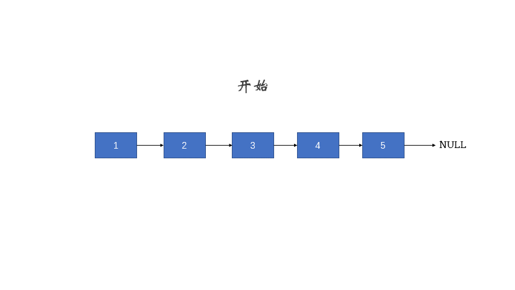

# 0. 数据结构

[数组与字符串](https://leetcode-cn.com/leetbook/detail/array-and-string/)—>[队列和栈](https://leetcode-cn.com/leetbook/detail/queue-stack/)—>[链表](https://leetcode-cn.com/leetbook/detail/linked-list/) —> [二叉树](https://leetcode-cn.com/leetbook/detail/data-structure-binary-tree/)

# 1. Array

## 实战题目

#### [11. 盛最多水的容器](https://leetcode-cn.com/problems/container-with-most-water/)（最大水面积）


> 步骤中使用max和min函数的典范


```java
class Solution { //java实现
    public int maxArea(int[] height) {
        //最大水容量，双指针
        if (height == null || height.length==0) {
            return 0;
        }
        int max_area = 0;
        int area = 0;
        int j = height.length-1;
        for (int i = 0; i < j; i++) {//当不考虑i逐步递进时，可以考虑使用while循环！！！
            //i指头，j指尾
            area = (j-i) * Math.min(height[i],height[j]);
            //前边的大，则后边指针j前移
            if (height[i]>=height[j]) {
                i--; //保证i指针不后移
                j--; //确保j指针向前移
            }
            max_area = Math.max(max_area, area);
        }
        return max_area;
    }
}
```


#### [283. 移动零](https://leetcode-cn.com/problems/move-zeroes/)

> 两个指针，j记录插入的位置，i进行探索,不为0的交换，为0的等后续j过来再处理

```java
//java
class Solution {
    public void moveZeroes(int[] nums)  {
        int length;
        if (nums == null || (length = nums.length) == 0) {
            return;
        }
        int j = 0;
        for (int i = 0; i < length; i++) {
            //i进行后续探索，j进行延后的定位，始终指向下一个存储位置
            if (nums[i] != 0) {//非0，则进行交换
                if (i > j) {
                    nums[j] = nums[i];
                    nums[i] = 0;
                }
                j++;
            }
        }
    }
}
```


#### [70. 爬楼梯](https://leetcode-cn.com/problems/climbing-stairs/)

- 自底向上

```java
protected int climbStairs(int n) {
        int f1 = 1;
        int f2 = 2;
        int f3 = 0;
        if (1==n){
            return f1;
        }else if (2==n){
            return f2;
        }
        for (int i = 2; i < n; i++) {
            f3 = f1 + f2;
            f1 = f2;
            f2 = f3;
        }
        return f2;
}
```


#### [剑指 Offer 10- I. 斐波那契数列](https://leetcode-cn.com/problems/fei-bo-na-qi-shu-lie-lcof/)

- 纯递归，会超出时间限制

```java

    public int fib(int n) {
        if (n == 0) return 0;
        if (n == 1) return 1;

        return fib(n-1)+fib(n-2);
}
```

- 带备忘录的递归

```java
public int fib1(int n) {
        //备忘录数组
        Integer[] array = new Integer[n+1];
        Arrays.fill(array,-1);

        return process(n,array);
    }

    private int process(int n, Integer[] array) {
        if (n==0) return 0;
        if (n==1) return 1;
        if (array[n] != -1) {  //巧妙之处
            return array[n];
        }
        array[n] = (process(n-1,array) + process(n-2,array))%1000000007;

        return array[n];
}
```

- dp数组迭代解法

```java
//dp数组迭代解法
public int fib2(int n) {
        if (n==0) return 0;
        if (n==1) return 1;
        //备忘录数组
        Integer[] array = new Integer[n+1];
        Arrays.fill(array,-1);

        array[0] = 0;
        array[1] = 1;
        for (int i = 2; i <= n; i++) {
            array[i] = (array[i-1] + array[i-2])%1000000007;
        }
        return array[n];
}
```

- 

```java
//dp解法，压缩空间
    public int fib3(int n) {
        if (n==0) return 0;
        if (n==1) return 1;
        //备忘录数组
        int a = 0;
        int b = 1;
        int fib = 0;
        for (int i = 2; i <= n; i++) {
            fib = (a+b)%1000000007;
            a = b;
            b = fib;
        }
        return b;
}
```


#### [1. 两数之和](https://leetcode-cn.com/problems/two-sum/) (两数之和)

```java
//java
class Solution {
    //数组中同一个元素不能使用两遍: 没有重复元素，且不能输出相同的下标。最终要返回两个下标
    public int[] twoSum(int[] nums, int target) {//对于返回下标的题可以考虑HashMap
        if (nums == null || nums.length == 0){
            return null;
        }

        HashMap<Integer, Integer> map = new HashMap<>(); //存储nums[i],i
        int tmp = 0;
        for (int i = 0; i < nums.length; i++) {
            tmp = target-nums[i];
            if (map.containsKey(tmp)){
                return new int[]{i,map.get(tmp)};
            }
            map.put(nums[i],i);
        }
        return null;
    }
}
class Solution3 { //66ms 39.9M
    //数组中同一个元素不能使用两遍: 没有重复元素，且不能输出相同的下标。最终要返回两个下标
    public int[] twoSum(int[] nums, int target) {//对于返回下标的题可以考虑
        if (nums == null || nums.length == 0){
            return new int[0];
        }
        int[] arr = new int[2];
        for (int i = 0; i < nums.length-1; i++) {
            for (int j = i+1; j < nums.length; j++) {
                if (nums[i]+nums[j] == target){
                    arr[0] = i;
                    arr[1] = j;
                    return arr;
                }
            }
            
        }

        return new int[0];
    }
}
```


#### [15. 三数之和](https://leetcode-cn.com/problems/3sum/)  (高频老题）

```java
//java
class Solution4 {
    public List<List<Integer>> threeSum(int[] nums) {
        //注意：答案中不可以包含重复的三元组。需要排序处理
        //非返回索引，可以排序
        List<List<Integer>> lists = new ArrayList<>();
        if (nums == null || nums.length<3) {
            return lists;
        }
        Arrays.sort(nums);

        //法1：暴力求解
       HashSet<List<Integer>> hashSet = new HashSet<>();
        for (int i = 0; i < nums.length-2; i++) {
            for (int j = i+1; j < nums.length-1; j++) {
                for (int k = j+1; k < nums.length; k++) {
                    if (nums[i] + nums[j] + nums[k] == 0){
                        ArrayList<Integer> list = new ArrayList<>();
                        list.add(nums[i]);
                        list.add(nums[j]);
                        list.add(nums[k]);
                        hashSet.add(list);
                    }
                }
            }
        }
        for (List<Integer> list: hashSet) {
            lists.add(list);
        }
        //法2：三指针
        for (int i = 0; i < nums.length; i++) {
            //判断首位，首位大于0，则没有满足的
            if (nums[i] > 0) {
                break;
            }
            //
            if (i > 0 && nums[i] == nums[i-1]) {
                continue;
            }
            int L = i+1;
            int R = nums.length-1;
            while (L< R){
                //进行判断
                int sum = nums[i] + nums[L] + nums[R];
                if (sum == 0){
                    lists.add(Arrays.asList(nums[i],nums[L],nums[R]));
                    //分别去重
                    while(L<R && nums[L]==nums[L+1]) L++;
                    while (R>L && nums[R]==nums[R-1]) R--;
                    //去重之后，再移一位
                    L++;
                    R--;
                }else if (sum < 0){
                    L++;
                }else if (sum>0){
                    R--;
                }
            }
        }
        return lists;
    }
}
```


#### [633. 平方数之和](https://leetcode-cn.com/problems/sum-of-square-numbers/)

```java

class Solution {//633. 平方数之和:给定一个非负整数 c ，判断是否存在两个整数 a 和 b，使得 a2 + b2 = c 
    public boolean judgeSquareSum(int c) {
        //定义双头指针
        int i = 0;
        int j = (int)Math.sqrt(c);//j=c时，c=1000000时结果为false,为什么？？？
        while(i<=j){
            int sum = i*i+j*j;
            if(sum==c){return true;}else{
                if(sum<c){i++;}else{j--;}
            }
        }
        return false;
        //时间复杂度：O（n）;空间复杂度：O(1);
    }
}
```


# 2. Linked List

## 实战题目

#### [206. 反转链表](https://leetcode-cn.com/problems/reverse-linked-list/)

- 反转法


> 这里是pre为前边的，cur为后边的，调换cur指向pre；然后向前推进

```java
class Solution {
    public ListNode reverseList(ListNode head) {
        ListNode prev = null;
        ListNode curr = head;
        while (curr != null) {
            ListNode next = curr.next;  //next进行保留探索的地址
            curr.next = prev;
            prev = curr;
            curr = next;
        }
        return prev;
    }
}
```


- 递归法


```java
//递归的方式
public ListNode reverseList(ListNode head) {
    // 1. 递归终止条件
    if (head == null || head.next == null) {
        return head;
    }
    ListNode p = reverseList(head.next);  //处理剩余节点
    head.next.next = head;
    head.next = null;
    return p;
}
```


- 神器的双指针



- 头插法

思路：

>  pre为头节点，head始终为前置节点，将cur节点从链表中断出来，并接到头节点后，注意此处的head节点一直不需要改变，因为1节点next位置，始终指的是

```java
public ListNode reverseList(ListNode head) {
    if(head == null) return null;
    ListNode pre = new ListNode();
    pre.next = head;
    ListNode cur = head.next;
    while(cur != null) {
        head.next = cur.next;
        cur.next = pre.next;
        pre.next = cur;
        cur = head.next;
    }
    return pre.next;

}
```


#### [24. 两两交换链表中的节点](https://leetcode-cn.com/problems/swap-nodes-in-pairs/)

思路：

> pre为头节点，记录头的位置，temp为最前边的节点，start和end为要操作的节点。


```java
class Solution {
    public ListNode swapPairs(ListNode head) { //实际上使用了四个指针
        ListNode pre = new ListNode(0);
        pre.next = head;
        ListNode temp = pre;
        while(temp.next != null && temp.next.next != null) {  //头插法
            ListNode start = temp.next;
            ListNode end = temp.next.next;
            temp.next = end;
            start.next = end.next;
            end.next = start;
            temp = start;
        }
        return pre.next;
    }
}
```


#### [141. 环形链表](https://leetcode-cn.com/problems/linked-list-cycle/)

题目：判断链表是否有环


思路：

> 存入set中进行去重

```java
public class Solution {
    public boolean hasCycle(ListNode head) {
        if (head == null) {
            return false;
        }
        HashSet<ListNode> hashSet = new HashSet<>();

        while (hashSet.add(head)){
            head = head.next;
            if (head == null){
                return false;
            }
        }
		
        return true;
    }
}
```

问题：怎么能使用O(1)的内存解决？

**快慢指针方式和数据漏洞方式**


#### [142. 环形链表 II](https://leetcode-cn.com/problems/linked-list-cycle-ii/)

题目：判断有环链表出现环的位置

> 快慢指针，快指针和慢指针在环里第一次相遇后，快指针变为慢指针从head处走，直至相遇，相交点即为进入环的点。

```java
class Solution2 {
    public ListNode detectCycle(ListNode head) {
        ListNode fast = head, slow = head;
        while (true) { //只能有一个退出循环条件
            if (fast == null || fast.next == null) return null;
            fast = fast.next.next;
            slow = slow.next;
            if (fast == slow) break;
        }
        fast = head;
        while (slow != fast) {
            slow = slow.next;
            fast = fast.next;
        }
        return fast;
    }
}
```


#### [25. K 个一组翻转链表](https://leetcode-cn.com/problems/reverse-nodes-in-k-group/)

题目：一个链表，k个节点为一组进行翻转。剩余节点保持原顺序。

思路：

```
任务分解：
```

```java
class Solution21 {
    public ListNode reverseKGroup(ListNode head, int k) {
        ListNode temp = new ListNode(0);
        temp.next = head;

        ListNode pre = temp;
        ListNode end = temp;
        while (end.next != null) {
            ListNode start = pre.next;
            for (int i = 0; i<k && end!=null ; i++) {
                end = end.next;
            }
            if (end == null) {
                break;
            }
            ListNode endNext = end.next;
            end.next = null;
            pre.next = reverse(start);
            //start此时已经是内部链表的尾部
            start.next = endNext;
            pre = start;
            end = start;
        }

        return temp.next;
    }

    private ListNode reverse(ListNode head) {
        //TODO:完成链表翻转，不需要使用头插法
        ListNode cur = null;    // cur - pre - tmp
        ListNode pre = head;
        while (pre != null){
            ListNode tmp = pre.next; //探索者
            pre.next = cur;
            cur = pre;
            pre = tmp;
        }
        return cur;
    }
}
```


## 课后作业

#### [26. 删除排序数组中的重复项](https://leetcode-cn.com/problems/remove-duplicates-from-sorted-array/)

tag: t双指针

题目：一个有序数组，原地删除重复出现的元素，使每个元素只出现一次，返回删除后数组的新长度。

不要使用额外的数组空间，你必须在**原地**修改输入数组** 并在使用 O(1) 额外空间的条件下完成。


```java
class Solution {
    public int removeDuplicates(int[] nums) {
        if (nums == null || nums.length == 0) {
            return 0;
        }
        int p = 0;// p进行保留
        int q = 1;//探索者

        while(q < nums.length) {
            if (nums[p] != nums[q]) {
                nums[p+1] = nums[q];
                p++;
            }
            q++;
        }
        return p+1;
    }
}

class Solution11 {
    public int removeDuplicates(int[] nums) {
        if (nums == null || nums.length==0) {
            return 0;
        }
        int low = 0;
        for (int i = 1; i < nums.length; i++) {
            if (nums[i] != nums[low]) {
                low++;
                nums[low] = nums[i];
            }
        }

        return low+1;
    }
}
```


#### [189. 旋转数组](https://leetcode-cn.com/problems/rotate-array/)

- **题目**

给定一个数组，将数组中的元素向右移动 `k` 个位置，其中 `k` 是非负数。

- 要求
  - 尽可能想出更多的解决方案，至少有三种不同的方法可以解决这个问题。
  - 你可以使用空间复杂度为 O(1) 的 **原地** 算法解决这个问题吗？
- 思路

> 1. 构建方法，每轮向右移动一位，进行k轮
> 2. 另外引入一个数组，将原数组的元素放到指定的位置:   newArr[(i+k)%n] = nums[i]

```java
class Solution20 {
    public void rotate(int[] nums, int k) {
        k = k%nums.length;
        if (nums.length == 0 || nums == null) {
            return;
        }
        int tem = 0;
        for (int i = 0; i < k; i++) {
            //每轮向右移动一位
            nums = rotate(nums);
        }
    }

    public int[] rotate(int[] nums) {
        int tmp = 0;
        tmp = nums[nums.length-1];
        for (int i = nums.length-1; i > 0; i--) {
            nums[i] = nums[i-1];
        }
        nums[0] = tmp;
        return nums;
    }
}
```

- 思路二

```java
public void rotate(int[] nums, int k) {
    int n = nums.length;
    int[] newArr = new int[n];
    for (int i = 0; i < n; ++i) {
        newArr[(i + k) % n] = nums[i];
    }
    System.arraycopy(newArr, 0, nums, 0, n);
}
```


#### [21. 合并两个有序链表](https://leetcode-cn.com/problems/merge-two-sorted-lists/)

- 合并两个有序链表   【递归】

思路：

- 固有思路

> 创建一个新的节点，分别对比两个链表，哪个小，加上。


```java
//java
//1. 固有思路
class Solution {
    public ListNode mergeTwoLists(ListNode l1, ListNode l2) {
        if (l1 == null) {
            return l2;
        }else if (l2 == null) {
            return l1;
        }
        // 使用带头结点的链表解决问题
        // 待输出链表的头部
        ListNode head = new ListNode();

        // 待输出链表的 last 结点
        ListNode last = head;
        while(l1 != null && l2 != null) {
            if(l1.val > l2.val) {
                last.next = l2;
                l2 = l2.next;
            }else{
                last.next = l1;
                l1 = l1.next;
            }
            last = last.next;
        }

        // l1 或 l2 可能还有剩余结点没有合并， 
        // 由于从上面的 while 循环中退出， 那么链表 l1 和 l2 至少有一个已经遍历结束
        if(l1 != null) last.next = l1;
        if(l2 != null) last.next = l2;

        return head.next;

    }
}

//递归思路
public ListNode mergeTwoLists(ListNode l1, ListNode l2) {
    if(l1 == null) {
        return l2;
    }
    if(l2 == null) {
        return l1;
    }

    if(l1.val < l2.val) {
        l1.next = mergeTwoLists(l1.next, l2);
        return l1;
    } else {
        l2.next = mergeTwoLists(l1, l2.next);
        return l2;
    }
}
```

#### [88. 合并两个有序数组](https://leetcode-cn.com/problems/merge-sorted-array/)

思路：

前提是nums1具有充足的大小：即 nums.length == m+n

> 1. 调用官方api，将nums2数组，复制到nums1的后边，并进行排序

```java
// 1.调用官方api
public void merge(int[] nums1, int m, int[] nums2, int n) {
    System.arraycopy(nums2,0,nums1,m,n);
    Arrays.sort(nums1);
}
// 2. 借助m个空间进行探索
public static void merge2(int[] nums1, int m, int[] nums2, int n) {
    //借助m个空间
    int[] arr = new int[m];  //先存储nums1中的所有元素，
    System.arraycopy(nums1,0,arr,0,m);  //
    int i = 0; //arr
    int j = 0; //nums2
    int k = 0; //nums1
    while (i<m && j<n) {
        if (arr[i]<nums2[j]) {
            nums1[k++] = arr[i++];
        }else {
            nums1[k++] = nums2[j++];
        }
    }
    if (i<m) {
        //此时nums2已经完成
        System.arraycopy(arr,i,nums1,i+j,m+n-i-j);
    }
    if (j<n) {
        //此时arr已经完成，可以省略，因为num1后面是剩下的排好序的数组，故可以不用管
        System.arraycopy(nums2,j,nums1,i+j,m+n-i-j);
    }
}
// 3.不借助空间，直接从nums1的后边进行插入
public static void merge3(int[] nums1, int m, int[] nums2, int n) {
    //不借助空间，直接从nums1的后面插
    int p1 = m-1; //记录nums1的比较节点
    int p2 = n-1; //记录nums2的比较节点
    int p = nums1.length-1; //
    while (p1>=0 && p2>=0) {
        if (nums1[p1] > nums2[p2]) {
            nums1[p--] = nums1[p1--];
        }else {
            nums1[p--] = nums2[p2--];
        }
    }
    if (p1<0) {
        //将nums2剩下的补齐
        System.arraycopy(nums2,0,nums1,0,p2+1);
    }
    if (p2<0) { //p2已经结束，p1剩下的不用管，就在那即可
        
    }
}
```


#### [66. 加一](https://leetcode-cn.com/problems/plus-one/)

- **题目：**传入一个数组，数组每个元素为单个数字，整个数组构成的数字基础上+1；并通过数组进行返回

- 思路

> 主要考虑什么时候进行进位操作

```java
//java
public int[] plusOne(int[] digits) {
    for (int i = digits.length-1; i >= 0; i--) {
        digits[i]++;
        digits[i] = digits[i]%10;
        //什么时候需要进位？ digits[i]+1==10时，进行进位
        if (digits[i]!=0) return digits;
    }
    digits = new int[digits.length+1];
    digits[0] = 1;
    return digits;
}
```


# 3. 栈、队列、优先队列、双端队列

#### [20. 有效的括号](https://leetcode-cn.com/problems/valid-parentheses/)

给定一个只包括 `'('`，`')'`，`'{'`，`'}'`，`'['`，`']'` 的字符串 `s` ，判断字符串是否有效。

```java
public static boolean isValid(String s) {
    if (s.length()%2==1)    return false;

    Stack<Character> stack = new Stack();
    for (char c:s.toCharArray()) {
        if (c == '(') {
            stack.push(')');
        } else if (c == '[') {
            stack.push(']');
        } else if (c == '{') {
            stack.push('}');
        } else if (stack.isEmpty() || c != stack.pop()) {
            return false;
        }
    }

    return stack.isEmpty();
}
```

#### [155. 最小栈](https://leetcode-cn.com/problems/min-stack/)


> 两种思路：
>
> 1. stack中存入entry<key, value>，key为值，value为当前min，始终保证stack.peek().getValue() 最小；  **PS：需要实现Entry接口**
> 2. 利用辅助栈，保持miniStack中栈顶为最小；  PS：要注意push进miniStack的边界值，以及pop，这两一定需统一来保持数据的一致

- stack中存储entry<key, value>，key为值，value为当前min

> 问题在于Map.Entry是接口，无法创建实例；所以最好能找到可以直接创建实例的Entry。

```java
class MinStack {

    private Deque<SEntry<Integer, Integer>> deque = new LinkedList<>();

    /** initialize your data structure here. */
    public MinStack() {
    }
    
   public class SEntry<K,V> implements Map.Entry<K,V> {  //实现Entry
        private K key;
        private V value;

        public SEntry(K k, V v) {
            key = k;
            value = v;
        }

        @Override
        public K getKey() {
            return key;
        }

        @Override
        public V getValue() {
            return value;
        }

        @Override
        public V setValue(V value) {
            this.value = value;
            return this.value;
        }
    }

    public void push(int x) {
        SEntry<Integer, Integer> entry = null;
        if (deque.isEmpty()) {
            entry = new SEntry<>(x,x);
        }else {
            //deque不空
            int min = deque.peek().getValue();
            if (x < min) {
                min = x;
            }
            entry = new SEntry<>(x,min);
        }
        deque.push(entry);
    }

    public void pop() {
        //从栈顶pop出，并要求最小值也在栈顶
        if (deque.isEmpty()) {
            return;
        }
        //不为空，直接pop
        deque.pop();   //保证栈顶的getValue始终是栈中的最小
    }

    public int top() {
        return deque.peek().getKey();
    }

    public int getMin() {
        //遍历一遍，再进行
        return deque.peek().getValue();
    }
}
```

> 使用可以已经实现的Entry:   AbstractMap.SimpleEntry<val,min> 分别存val和最小值

```java
import java.util.*;

class MinStack {

    private Deque<AbstractMap.SimpleEntry<Integer,Integer>> deque = new LinkedList();

    public MinStack() {
    }

    public void push(int val) {
        if(deque.size() == 0) {
            deque.push(new AbstractMap.SimpleEntry<Integer,Integer>(val,val));
        } else {
            deque.push(new AbstractMap.SimpleEntry<Integer,Integer>(val,Math.min(deque.peek().getValue(), val)));
        }
    }

    public void pop() {
        deque.pop();
    }

    public int top() {
        return deque.peek().getKey();
    }

    public int getMin() {
        return deque.peek().getValue();
    }
}
```


- 辅助栈法

  创建两个栈，一个栈用来存储所有内容，一个栈用来存储当前的最小值。有最小值压入，就两边一块压，有最小值pop出，一块出

```java
class MinStack {

    private Stack<Integer> stack;
    private Stack<Integer> minStack;

    /** initialize your data structure here. */
    public MinStack() {
        stack = new Stack<>();
        minStack = new Stack<>();
    }

    public void push(int x) {
        stack.push(x);
        /*if (!minStack.isEmpty()) {
                if (x <= minStack.peek()) {
                    minStack.push(x);
                }
            }else {
                minStack.push(x);
            }*/
        if (minStack.isEmpty()) {
            minStack.push(x);
        }else {
            //不为空
            if (x <= minStack.peek()) {  //注意这里是相等，为了保证pop时一致性
                minStack.push(x);
            }
        }
    }

    public void pop() {
        int pop = stack.pop();
        if (pop == minStack.peek()) {
            minStack.pop();
        }
    }

    public int top() {
        return stack.peek();
    }

    public int getMin() {
        return minStack.peek();
    }
}
```


## 实战题目

#### [84. 柱状图中最大的矩形](https://leetcode-cn.com/problems/largest-rectangle-in-histogram/)


>以高为准，进行求解，暴力解法是依次遍历当前高，再左找、右找确定当前高所能获得的最大的宽，遍历下去即可获得最大的面积。  PS:但是容易超时。

题解：[暴力解法、单调栈+哨兵技巧](https://leetcode-cn.com/problems/largest-rectangle-in-histogram/solution/bao-li-jie-fa-zhan-by-liweiwei1419/)

- 暴力解法超出了时间限制（遍历高）

```java
class Solution {
    public int largestRectangleArea(int[] heights) {
        if (heights == null || heights.length == 0) return 0;

        int maxArea = 0;
        //遍历高，左右找比其小的，看面积
        for (int i = 0; i < heights.length; i++) {
            //以一个高位基,因为要左右摇摆，所以不能用forj遍历
            //先左
            int left = i;
            int currentHeight = heights[i];
            while (left>0 && heights[left-1] >= currentHeight) {
                left--;
            }

            //后右
            int right = i;
            while (right<heights.length-1 && heights[right+1] >= currentHeight) {
                right++;
            }

            int width = right-left+1;
            maxArea = Math.max(maxArea, width * currentHeight);
        }

        return maxArea;
    }
}
```

- 单调栈+哨兵技巧

> 单调栈：我们在缓存数据的时候，是从左向右缓存的，我们计算出一个结果的顺序是从右向左的，并且计算完成以后我们就不再需要了，符合后进先出的特点。因此，我们需要的这个作为缓存的数据结构就是栈。
>
> 哨兵体现在 左右各安排一个最小值，可排除特殊情况，保持一致的处理。
>
> ​		左边的柱形（第 1 个柱形）由于它一定比输入数组里任何一个元素小，它肯定不会出栈，因此栈一定不会为空；
>
> ​		右边的柱形（第 2 个柱形）也正是因为它一定比输入数组里任何一个元素小，它会让所有输入数组里的元素出栈（第 1 个哨兵元素除外）。
>

> **参照题解的个人理解：**
>
> 什么时候可以确定依赖于当前高能够得到的最大宽？
>
> 答： 当遍历时，找到右侧第一个小于栈顶高的，此时即可确定栈顶高的面积。
>
> 右侧已经无法延展，左侧紧邻的栈中元素一定比栈顶的元素小，但只要比栈顶右侧的值大，则可确定新的面积。
>
> 先前压入栈中的值，应当比当前栈顶的值小。
>
> for循环往前走，while循环向后退。

```java
public int largestRectangleArea(int[] heights) {
    int len = heights.length;
    if (len == 0) {
        return 0;
    }

    if (len == 1) {
        return heights[0];
    }

    int res = 0;

    int[] newHeights = new int[len + 2];
    newHeights[0] = 0;
    System.arraycopy(heights, 0, newHeights, 1, len);
    newHeights[len + 1] = 0;
    len += 2;
    heights = newHeights;

    Deque<Integer> stack = new ArrayDeque<>(len);
    // 先放入哨兵，在循环里就不用做非空判断
    stack.addLast(0);

    for (int i = 1; i < len; i++) {
        while (heights[i] < heights[stack.peekLast()]) {
            int curHeight = heights[stack.pollLast()];
            int curWidth = i - stack.peekLast() - 1;
            res = Math.max(res, curHeight * curWidth);
        }
        stack.addLast(i);
    }
    return res;
}
```

以下列出了单调栈的问题，供大家参考。

| 序号 | 题目                          | 题解                                      |
| ---- | ----------------------------- | ----------------------------------------- |
| 1    | 42. 接雨水（困难）            | 暴力解法、优化、双指针、单调栈            |
| 2    | 739. 每日温度（中等)          | 暴力解法 + 单调栈                         |
| 3    | 496. 下一个更大元素 I（简单） | 暴力解法、单调栈                          |
| 4    | 316. 去除重复字母（困难）     | 栈 + 哨兵技巧（Java、C++、Python）        |
| 5    | 901. 股票价格跨度（中等）     | 「力扣」第 901 题：股票价格跨度（单调栈） |
| 6    | 402. 移掉K位数字              |                                           |
| 7    | 581. 最短无序连续子数组       |                                           |

#### [239. 滑动窗口最大值](https://leetcode-cn.com/problems/sliding-window-maximum/)

[「单调队列」数据结构解决滑动窗口问题  题解](https://mp.weixin.qq.com/s?__biz=MzAxODQxMDM0Mw==&mid=2247488087&idx=1&sn=673aa4e8deb942b951948650928c336e&chksm=9bd7ec5faca06549ba6176540fef04f93c1c9f55b303106688b894a2029e00b8cce1a9ba57a4&scene=21#wechat_redirect)

```java
public class L239_2 {

    //构建单调栈
    public class MonotonicQueue {
        LinkedList<Integer> q = new LinkedList<>();

        public void push(int n) { //当一个较大值过来，形成对前边小的值的压制，从而再后续无法发挥作用
            while (!q.isEmpty() && q.getLast()<n) {
                //比n小的都被踢出
                q.pollLast();
            }
            q.offerLast(n); //尾插
        }

        public Integer max() {  //队列的第一个为最大值
            return q.getFirst();
        }

        public void pop(int n) { //可能n已经被压制的踢出了
            if (n == q.getFirst()) {
                q.pollFirst();
            }
        }
    }

    public int[] maxSlidingWindow(int[] nums, int k) {
        if (nums == null || nums.length == 0 || k==0) return nums;
        MonotonicQueue mq = new MonotonicQueue();

        List<Integer> list = new ArrayList<>();

        for (int i = 0; i < nums.length; i++) {
            //整个数组过一遍
            if(i < k-1) {
                //填满前两个
                mq.push(nums[i]);
            }else {
                mq.push(nums[i]);
                list.add(mq.max());
                mq.pop(nums[i-k+1]);
            }
        }

        int[] result = new int[nums.length-k+1];
        for (int i = 0; i < list.size(); i++) {
            result[i] = list.get(i);
        }
        return result;
    }

    public static void main(String[] args) {
        int[] nums = {1,3,-1,-3,5,3,6,7};
        int k = 3;
        System.out.println(Arrays.toString(new L239_2().maxSlidingWindow(nums, k)));
    }
}
```


## 课后作业

#### 用 add first 或 add last 这套新的 API 改写 Deque 的代码


#### 分析 Queue 和 Priority Queue 的源码


#### [622. 设计循环队列](https://leetcode-cn.com/problems/design-circular-queue/)

> 循环队列，头删尾插，这里的容量限定；

- 数组实现

```java
public class L622_shejixunhuanduilie {

    private int[] queue;
    private int headIndex;
    private int count;
    private int capacity;

    public L622_shejixunhuanduilie(int k) {
        this.queue = new int[k];
        this.headIndex = 0;
        this.count = 0;
        this.capacity = k;
    }

    //插入一个元素到循环队列
    public boolean enQueue(int value) {
        if (this.count == this.capacity) {
            return false;
        }else {
            queue[(this.headIndex+this.count)%this.capacity] = value;
            count++;
            return true;
        }
    }

    public boolean deQueue() {
        if (this.isEmpty()) return false;
        //不为空时,出队
        this.headIndex = (this.headIndex+1) % this.capacity;
        count--;
        return true;
    }

    public int Front() {
        if (this.count == 0) return -1;
        return this.queue[this.headIndex];
    }

    public int Rear() {
        if (this.count == 0) return -1;
        return this.queue[(this.headIndex+this.count-1)%this.capacity];
    }

    public boolean isEmpty() {
        if (this.count == 0) return true;
        return false;
    }

    public boolean isFull() {
        if (this.capacity == this.count) return true;
        return false;
    }
}
```

- 链表实现

```java
class Node{
    public int value;
    public Node nextNode;
    public Node(int value){
        this.value = value;
        this.nextNode = null;
    }
}

/**
 * @ClassName L622_shejixunhuanduilie
 * @Description
 */
public class L622_shejixunhuanduilie_list {
    //尾插头删
    private Node head,tail;
    private int count;
    private int capacity;

    public L622_shejixunhuanduilie_list(int k) {
        this.capacity = k;
    }

    //插入一个元素到循环队列
    public boolean enQueue(int value) {
        if (this.count == this.capacity) return false;
        Node node = new Node(value);
        if (this.count == 0) {
            head = tail = node;
        } else {
            tail.nextNode = node;
            tail = node;
        }
        this.count++;
        return true;
    }

    public boolean deQueue() {
        if (this.isEmpty()) return false;
        //不为空时,头删
        head = head.nextNode;
        this.count--;
        return true;
    }

    public int Front() {
        if (this.count == 0) return -1;
        return head.value;
    }

    public int Rear() {
        if (this.count == 0) return -1;
        return tail.value;
    }

    public boolean isEmpty() {
       return this.count == 0;
    }

    public boolean isFull() {
        return this.count == this.capacity;
    }
}
```


#### [641. 设计循环双端队列](https://leetcode-cn.com/problems/design-circular-deque/)

```java
public class L641 {

    //用数组比较好
    private int[] deque;
    private int headIndex;
    private int count;
    private int capacity;

//    * Initialize your data structure here. Set the size of the deque to be k.
    public L641(int k) {
        this.capacity = k;
        this.deque = new int[k];
        this.headIndex = 0;
        this.count = 0;
    }

//    * Adds an item at the front of Deque. Return true if the operation is successful.
    public boolean insertFront(int value) {
        if (this.capacity == this.count) return false;
        //能头插
        //头像前移
        headIndex = (headIndex+capacity-1) % capacity;
        deque[headIndex] = value;
        count++;
        return true;
    }

//    * Adds an item at the rear of Deque. Return true if the operation is successful.
    public boolean insertLast(int value) {
        if (this.capacity == this.count) return false;
        //能尾插，先找尾
        int tailIndex = (headIndex+count) % capacity;
        deque[tailIndex] = value;
        count++;
        return true;
    }

//    * Deletes an item from the front of Deque. Return true if the operation is successful.
    public boolean deleteFront() {
        if (this.count == 0) return false;
        //不为空，能头删
        headIndex = (headIndex+1) % capacity;
        count--;
        return true;
    }

//    * Deletes an item from the rear of Deque. Return true if the operation is successful.
    public boolean deleteLast() {
        if (this.count == 0) return false;
        //尾删
        count--;  //注意这里
        return true;
    }

//    * Get the front item from the deque.
    public int getFront() {
        if (this.count == 0) return -1;
        return deque[headIndex];
    }

//    * Get the last item from the deque.
    public int getRear() {
        if (this.count == 0) return -1;
        int tailIndex = (headIndex+count-1) % capacity;  //注意这里
        return deque[tailIndex];
    }

//    * Checks whether the circular deque is empty or not.
    public boolean isEmpty() {
        return this.count == 0;
    }

//    * Checks whether the circular deque is full or not.
    public boolean isFull() {
        return this.count == this.capacity;
    }

}
```

- 链表实现

[链表实现题解](https://leetcode-cn.com/problems/design-circular-deque/solution/java-lian-biao-shi-xian-by-zanyjoker/)

```java

```


#### [42. 接雨水](https://leetcode-cn.com/problems/trapping-rain-water/)


> 单调栈的方式可以继续进行探究


# 4. 哈希表、映射、集合

#### [242. 有效的字母异位词](https://leetcode-cn.com/problems/valid-anagram/)


>异位词：指字母相同，但排列不同的字符串。
>
>考虑长度、统计每个字符出现的次数。采用数组、hashmap的方式统计。也可以采用排序后的字符数组进行比对。

```java
public class L242_valid_anagram {

    // 该方法是最通常的解法
    public boolean isAnagram1(String s, String t) {

        char[] sarray = s.toCharArray();
        char[] tarray = t.toCharArray();
        Arrays.sort(sarray);
        Arrays.sort(tarray);
//        return Arrays.equals(sarray, tarray);
        return String.valueOf(sarray).equals(String.valueOf(tarray));  //更快
    }
    
    //使用hash表的思想：以数据方式
    public boolean isAnagram2(String s, String t) {
        if (s.length() != t.length()) return false;

        int[] array = new int[26];
        for (int i = 0; i < s.length(); i++) {
            array[s.charAt(i)-'a']++;
        }
        for (int i = 0; i < t.length(); i++) {
            array[s.charAt(i)-'a']--;
            if (array[s.charAt(i)-'a'] < 0) return false;
        }

        return true;
    }

    //使用hashmap的方式
    public boolean isAnagram3(String s, String t) {
        if (s.length() != t.length()) return false;
        Map<Character, Integer> map = new HashMap<>();

        for (int i = 0; i < s.length(); i++) {
            char ch = s.charAt(i);
            map.put(ch,map.getOrDefault(ch,0)+1);
        }

        for (int i = 0; i < t.length(); i++) {
            char ch = t.charAt(i);
            map.put(ch,map.getOrDefault(ch,0)-1);

            if (map.get(ch) < 0) return false;
        }

        return true;
    }
}
```


#### [49. 字母异位词分组](https://leetcode-cn.com/problems/group-anagrams/)

>分析题：要将异位词进行分组，
>
>暴力解法：通过双重遍历，外层负责覆盖所有的，内层负责判断是否异位以及进行存入。
>
>map的方式：要解决key是什么？value是什么？
>
>在这里key取排序后的字符串，value为list，list中存储每一个字符串。

- 暴力解法

```java
public List<List<String>> groupAnagrams(String[] strs) {
    if (strs == null || strs.length == 0) return null;

    List<List<String>> resultList = new LinkedList<>();
    for (int i = 0; i < strs.length; i++) {
        if (strs[i] == null) continue;
        //从头往后判断，如果异位，则添加进去
        List<String> itemList = new LinkedList<>();
        for (int j = strs.length-1; j > i; j--) {
            if (strs[j]!=null && isYiWei(strs[i],strs[j])) {
                //是异位词
                itemList.add(strs[j]);
                strs[j] = null;
            }
        }
        itemList.add(strs[i]);
        resultList.add(itemList);
    }
    return resultList;
}

private boolean isYiWei(String str1, String str2) {
    if (str1.length() != str2.length()) return false;
    char[] chars1 = str1.toCharArray();
    char[] chars2 = str2.toCharArray();
    Arrays.sort(chars1);
    Arrays.sort(chars2);
    return String.valueOf(chars1).equals(String.valueOf(chars2));
}
```

- 使用hash的思想进行存储与输出

```java
public List<List<String>> groupAnagrams(String[] strs) {
        if (strs == null || strs.length == 0) return null;
        Map<String, List<String>> map = new HashMap<>();

        for (int i = 0; i < strs.length; i++) {
            //存
            char[] chars = strs[i].toCharArray();
            Arrays.sort(chars);
            String str = Arrays.toString(chars);
            List<String> list = map.getOrDefault(str, new ArrayList<>());
            list.add(strs[i]);
            map.put(str, list); 
        }
        return new ArrayList<>(map.values());
}
```


#### [3. 无重复字符的最长子串](https://leetcode-cn.com/problems/longest-substring-without-repeating-characters/)

> 使用到了Set数据结构，滑动窗口


> 采用滑动窗口的方式，左右双指针，右指针探索，并始终保持Set集合中的字符不重复;
>
> 当出现重复时,左侧的字符从set中移除,**右侧仍旧可以继续探索.**

- 滑动窗口法，使用set

```java
public int lengthOfLongestSubstring(String s) {
        if (s == null) return 0;
        char[] chars = s.toCharArray();
        
        int maxLength = 0;
        Set<Character> set = new HashSet<>();
        int rightIndex = 0;
        for (int i = 0; i < s.length(); i++) {
            //右下标后移
            while (rightIndex < s.length() && !set.contains(chars[rightIndex])) {
                set.add(chars[rightIndex]);
                rightIndex++;
            }
            //右下边移到了重复的
            maxLength = Math.max(maxLength, set.size());  //rightIndex-i+1

            //左下标+1，并且移除chars[i]
            set.remove(chars[i]);
        }
        return maxLength;
}
```

- 滑动窗口法，使用map

```java
public int lengthOfLongestSubstring(String s) {
        if (s.length()==0) return 0;
        HashMap<Character, Integer> map = new HashMap<Character, Integer>();
        int max = 0;
        int left = 0;
        for(int i = 0; i < s.length(); i ++){
            if(map.containsKey(s.charAt(i))){
                left = Math.max(left,map.get(s.charAt(i)) + 1);
            }
            map.put(s.charAt(i),i);
            max = Math.max(max,i-left+1);
        }
        return max;
        
}
```


# 5. 树、二叉树、二叉搜索树

#### [94. 二叉树的中序遍历](https://leetcode-cn.com/problems/binary-tree-inorder-traversal/)

> 中序遍历：左根右

- 递归方式 （省略，太简单）

- 迭代方式: 显示的维护一个栈

```java
//采用维护一个显示栈的方式来中序遍历
    public List<Integer> inorderTraversal1(TreeNode root) {
        List<Integer> resultList = new ArrayList<>();
        if (root == null) return resultList;

        Deque<TreeNode> stack = new ArrayDeque<>();

        //构建循环   左 根 右  =》  压栈顺序   根 读左， 读根  再到右侧
        while (root != null || !stack.isEmpty()) {
            //要一直走到最后
            while(root != null) {
                stack.push(root);
                root = root.left;
            }
            //此时root必定为空，则root.right也为空，如此即可保证
            root = stack.pop();
            //走到的最左边的子节点
            resultList.add(root.val);
            root = root.right;

        }
        return resultList;
}
```

- Morris中序遍历：时间复杂度O(n),空间复杂度O(1）

> 左根右，核心思想是先找到当前根节点的左子树的最右侧的节点，让该节点连接到其后驱即根节点。

```java
class Solution {
    public List<Integer> inorderTraversal(TreeNode root) {
        List<Integer> res = new ArrayList<Integer>();
        TreeNode predecessor = null;

        while (root != null) {
            if (root.left != null) {
                // predecessor 节点就是当前 root 节点向左走一步，然后一直向右走至无法走为止
                predecessor = root.left;
                while (predecessor.right != null && predecessor.right != root) {
                    predecessor = predecessor.right;
                }
                
                // 让 predecessor 的右指针指向 root，继续遍历左子树
                if (predecessor.right == null) {
                    predecessor.right = root;
                    root = root.left;
                }
                // 说明左子树已经访问完了，我们需要断开链接
                else {
                    res.add(root.val);
                    predecessor.right = null;
                    root = root.right;
                }
            }
            // 如果没有左孩子，则直接访问右孩子
            else {
                res.add(root.val);
                root = root.right;
            }
        }
        return res;
    }
}
```


#### [144. 二叉树的前序遍历](https://leetcode-cn.com/problems/binary-tree-preorder-traversal/)

- 递归版的前序遍历（省略，太简单）

- 使用显示栈的方式进行遍历

```java
public List<Integer> preorderTraversal1(TreeNode root) {
        List<Integer> resultList = new ArrayList<>();
        if (root == null) return resultList;
        Deque<TreeNode> stack = new LinkedList<>();
        stack.push(root);
        //根左右
        while (!stack.isEmpty()) {

            TreeNode treeNode = stack.pop();
            if (treeNode.val != null) {
                resultList.add(treeNode.val);
            }

            if (treeNode.right != null) {
                stack.push(treeNode.right);
            }

            if (treeNode.left != null) {
                stack.push(treeNode.left);
            }
        }
        return resultList;
}
```


#### [145. 二叉树的后序遍历](https://leetcode-cn.com/problems/binary-tree-postorder-traversal/)

- 迭代方式

> 特别注意 如果要是想输出上一层的，一定是通过栈pop出去的，但要防止重复入左或者入右，防止入左可以通过将root置0，防止入右可以通过记录先前已经访问过的右节点，来避免。

```java
//迭代的方式： 左 右  根
    public List<Integer> postorderTraversal1(TreeNode root) {
        List<Integer> resultList = new ArrayList<>();
        if (root == null) return resultList;
        Deque<TreeNode> stack = new ArrayDeque<>();
        TreeNode prev = null;
        while (root != null || !stack.isEmpty()) {
            //根  右   左进行压栈
            while(root != null) {
                stack.push(root);
                root = root.left;
            }
            // root此时为空
            root = stack.pop();  //此时只知其左没有，不知其右
            //resultList.add(root.val);

            if (root.right == null || root.right == prev) {
                //右节点没有了
                resultList.add(root.val);
                prev = root;
                root = null;
            } else {
                //右节点有
                stack.push(root);
                root = root.right;  //但要防止之后再回到该右分支，使用prev记录分离点
            }
        }
        
        return resultList;
}
```

- 使用两个栈进行(很好理解)  也可用于先序遍历

```java
public List<Integer> postorderTraversal2(TreeNode root) {
        //非递归方式
        //定义两个栈s1,s2，将root压入s1
        //从s1出栈，并将该节点压入s2，接着将节点的左右节点压入s1
        //重复上一步操作，直到s1为空，依此从s2中出栈即可
        List<Integer> list = new ArrayList<>();
        if(root == null) {
            return list;
        }
        Stack<TreeNode> s1 = new Stack<>();
        Stack<TreeNode> s2 = new Stack<>();
        s1.push(root);
        TreeNode cur = root;
        while(!s1.empty()) {
            TreeNode node = s1.pop();
            if(node.left != null) {
                s1.push(node.left);
            }
            if(node.right != null) {
                s1.push(node.right);
            }
            s2.push(node);
        }
        while(!s2.empty()) {
            TreeNode tmp = s2.pop();
            list.add(tmp.val);
        }
        return list;
}
```


#### [102. 二叉树的层序遍历](https://leetcode-cn.com/problems/binary-tree-level-order-traversal/)

> 注意控制好何时进行出队，以及什么时候添加到itemList中去，考虑怎么限定循环次数

- **广度优先进行迭代**

```java
public List<List<Integer>> levelOrder(TreeNode root) {
        List<List<Integer>> resultList = new LinkedList<List<Integer>>();
        if (root == null) return resultList;

        Deque<TreeNode> queue = new LinkedList<>();
        queue.offer(root);
        while (!queue.isEmpty()) {
            List<Integer> itemList = new LinkedList<>();

            int currentLength = queue.size(); //限定每次循环循环次数
            
            for (int i = 1; i <= currentLength; i++) {
                //出根，添加到itemList中
                TreeNode node = queue.poll();  //
                itemList.add(node.val);
                //进左
                if (node.left != null) {
                    queue.offer(node.left);
                }

                //进右
                if (node.right != null) {
                    queue.offer(node.right);
                }
            }
            resultList.add(itemList);

        }
        return resultList;
}
```

- 深度优先搜索采用递归的方式

分别将每一层放到其相应的list中

```java
public List<List<Integer>> levelOrder1(TreeNode root) {
        if(root==null) {
            return new ArrayList<List<Integer>>();
        }
        //用来存放最终结果
        List<List<Integer>> res = new ArrayList<List<Integer>>();
        dfs(1,root,res);
        return res;
    }

    void dfs(int index,TreeNode root, List<List<Integer>> res) {
        //假设res是[ [1],[2,3] ]， index是3，就再插入一个空list放到res中
        if(res.size()<index) {
            res.add(new ArrayList<Integer>());
        }
        //将当前节点的值加入到res中，index代表当前层，假设index是3，节点值是99
        //res是[ [1],[2,3] [4] ]，加入后res就变为 [ [1],[2,3] [4,99] ]
        res.get(index-1).add(root.val);
        //递归的处理左子树，右子树，同时将层数index+1
        if(root.left!=null) {
            dfs(index+1, root.left, res);
        }
        if(root.right!=null) {
            dfs(index+1, root.right, res);
        }
}
```


#### [107. 二叉树的层序遍历 II](https://leetcode-cn.com/problems/binary-tree-level-order-traversal-ii/)


#### [589. N 叉树的前序遍历](https://leetcode-cn.com/problems/n-ary-tree-preorder-traversal/)


- 递归

```java
public List<Integer> preorder(Node root) {
        List<Integer> resultList = new ArrayList<>();
        if (root == null) return resultList;

        preTraverse(root, resultList);
        return resultList;

    }

    private void preTraverse(Node root, List<Integer> resultList) {
        if (root == null) return;
        //根
        resultList.add(root.val);
        //下一层
        for(Node node: root.children) {
            preTraverse(node, resultList);
        }
}
```

- 迭代（在List遍历时，最好使用foreach来进行遍历，不会产生越界问题）

```java
public List<Integer> preorder(Node root) {
        List<Integer> resultList = new ArrayList<>();
        if(root == null) return resultList;

        Deque<Node> stack = new LinkedList<>();
        stack.push(root);
        while(!stack.isEmpty()) {
            int curLength = stack.size();
            Node node = stack.pop();
            resultList.add(node.val);
            //将其child反序入栈
            Collections.reverse(node.children);
            // for(int i=0; i < curLength; i++) {  //这种方式会越界
            //     stack.push(node.children.get(i));
            // }
            for(Node child : node.children) {
                stack.push(child);
            }
        }
        return resultList;
}
```


#### [590. N 叉树的后序遍历](https://leetcode-cn.com/problems/n-ary-tree-postorder-traversal/)

```java
public List<Integer> postorder(Node root) {
        LinkedList<Integer> resultList = new LinkedList<>();  //只有LinkedList才可以,才实现了addFirst
        if(root == null) return resultList;

        Deque<Node> stack = new LinkedList<>();
        stack.push(root);

        //
        while(!stack.isEmpty()) {
            Node node = stack.pop();
            //头插
            resultList.addFirst(node.val);

            for(Node child: node.children) {
                //从左到右入栈，则出栈顺序为从右到左
                stack.push(child);
            }
        }
        return resultList;
}
```


#### [429. N 叉树的层序遍历](https://leetcode-cn.com/problems/n-ary-tree-level-order-traversal/)

```java
public List<Integer> preorder(Node root) {
        List<Integer> resultList = new ArrayList<>();
        if(root == null) return resultList;

        Deque<Node> queue = new LinkedList<>();
        queue.offer(root);
        while(!queue.isEmpty()) {
            int currentSize = queue.size();
            for(int i=0; i<currentSize; i++) {
                Node node = queue.poll();
                resultList.add(node.val);
                for(Node child: node.children) {
                    queue.offer(child);
                }
            }
        }
        return resultList;
}
```


# 6. 递归、泛型递归、树的递归

## 实战题目


#### [22. 括号生成](https://leetcode-cn.com/problems/generate-parentheses/)


> 解析题：
>
> 生成所有有效额度括号组合，首先想到的方式是暴力穷举，怎么能够穷举出所有组合呢？
>
> 该问题可以转化为对二叉树的遍历问题，采用深度优先搜索，来获得每一条路径，存储在string中，在一棵完全二叉树进行遍历。并对不满足条件的进行剪枝。

- **DFS方式**

[题解](https://leetcode-cn.com/problems/generate-parentheses/solution/pei-yang-chou-xiang-si-wei-hui-su-jie-fa-7dwu/)

```java
public List<String> generateParenthesis(int n) {
        List<String> list = new ArrayList<>();
        String path = "";
        //穷举DFS
        dfs(n,list, path, 0, 0);
        return list;
    }

    private void dfs(int n, List<String> list, String path, Integer open, Integer close) {
//        if (open > n || close > open) return;   //进行剪枝，还有另一种方式
        //根  左   右
        if(path.length() == 2*n) {
            list.add(path);
            return;
        }
        //左
        if (open < n) { //才会向左访问
            dfs(n, list, path + "(", open + 1, close);
        }
        //右
        if(close < open) { //才会向右访问
            dfs(n, list, path + ")", open, close + 1);
        }
}
```


#### [494. 目标和](https://leetcode-cn.com/problems/target-sum/)


- DFS方式

```java
	int count = 0;
    public int findTargetSumWays(int[] nums, int S) {
        calculate(nums, 0, 0, S);
        return count;
    }
    public void calculate(int[] nums, int i, int sum, int S) {
        if (i == nums.length) { // i为遍历的层数
            if (sum == S)
                count++;
        } else {
            calculate(nums, i + 1, sum + nums[i], S);
            calculate(nums, i + 1, sum - nums[i], S);
        }
	}
```

- 动态规划方式

  


#### [226. 翻转二叉树](https://leetcode-cn.com/problems/invert-binary-tree/)


- 先序遍历   根左右

自顶向下的思路，进行递归调整

```java
public TreeNode invertTree(TreeNode root) {
        if(root == null) {
            return null;
        }

        //根左右
        TreeNode tmp = root.right;
        root.right = root.left;
        root.left = tmp;
        //在这里 root的left已经被改变，为先前的右子树
        invertTree(root.left);
        //在这里 root的left已经被改变，为先前的左子树
        invertTree(root.right);
        return root;
    }
```


#### [98. 验证二叉搜索树](https://leetcode-cn.com/problems/validate-binary-search-tree/)


> 思路： 利用二叉搜索树中序遍历的有序性，来判断二叉搜索树是否是有效

- 中序遍历

```java
 List<Integer> list = new ArrayList<>();
    //根 左 右
    public boolean isValidBST(TreeNode root) {
        if(root == null) {
            return false;
        }


        MidTraverse(root);

        for (int i = 0; i < list.size()-1; i++) {
            if(list.get(i) >= list.get(i+1)) {
                return false;
            }
        }
        return true;
    }

    //中序遍历
    private void MidTraverse(TreeNode root) {
        if(root == null) {
            return;
        }

        //左  根  右
        MidTraverse(root.left);

        list.add(root.val);

        MidTraverse(root.right);
    }
```


#### [104. 二叉树的最大深度](https://leetcode-cn.com/problems/maximum-depth-of-binary-tree/)


> 想法：
>
> 可以采用深度优先遍历（根左右）来进行，最终记录其深度;不需使用count进行计数，使用BFS才需要进行计数，深度优先一定要遵循递归的思想。

- DFS ：使用了返回值来获得最大深度

```java
public int maxDepth(TreeNode root) {
        if(root == null) {
            return 0;
        } else {
            int left = maxDepth(root.left);
            int right = maxDepth(root.right);
            return Math.max(left, right)+1;
        }
}
```

- 如果不使用返回值，而使用普通属性呢？

```java
//使用公共的变量时
    int max = Integer.MIN_VALUE;
    public int maxDepth1(TreeNode root) {
        if(root == null) {
            return 0;
        }
        traverse(root,1);
        return max;
    }

    private void traverse(TreeNode root, int level) {
        if(root == null) {
            return;
        }
        if(root.left == null && root.right == null) { //发现子节点时，更新max值
            max = Math.max(max, level);
        }
        traverse(root.left, level+1);
        traverse(root.right,level+1);
}
```


#### [111. 二叉树的最小深度](https://leetcode-cn.com/problems/minimum-depth-of-binary-tree/)


> 想法：~~该题与上一题相对应，求二叉树的最小深度~~ （有坑）

[题解](https://leetcode-cn.com/problems/minimum-depth-of-binary-tree/solution/111-er-cha-shu-de-zui-xiao-shen-du-di-gu-ztum/)

```java
int leftDepth = getDepth(node->left);
int rightDepth = getDepth(node->right);
int result = 1 + min(leftDepth, rightDepth);
return result;
```

如果递归函数中这么写，会出现这种错误


这样求，则最小深度为1，故我们要排除这种情况。

**需要注意的是，只有当左右孩子都为空的时候，才说明遍历的最低点了。如果其中一个孩子为空则不是最低点**

- root == null 时， return 0
- root != null && root.right == null && root.left == null时， return 1
- root != null && root.left != null && root.right == null时， return 左子树的最小值+1
- root != null && root.left == null && root.right != null时，return 右子树的最小值+1
- root != null && root.left != null && root.right != null时， return min(左子树的最小值, 右子树的最小值)+1

```java
public int minDepth(TreeNode root) {
        if(root == null) {
            return 0;
        }
        if(root.left == null && root.right == null) {
            return 1;
        }

        //左  右  根
        int left = minDepth(root.left);
        int right = minDepth(root.right);

        if(root.left != null && root.right == null) {
            return left+1;
        }
        
        if(root.left == null && root.right != null) {
            return right+1;
        }
        //左右都不为空
        return Math.min(left, right)+1;
}
```


- 另一种更好理解的思路： **<font color='red'>这种方式更好</font>**

> 直接使用成员变量来记录，问题的关键是在遇到子节点时，更新min值

```java
class Solution {
    int min = Integer.MAX_VALUE;
    public int minDepth(TreeNode root) {
        if (root == null) return 0;
        minDepth(root, 1);
        return min;
    }

    public void minDepth(TreeNode root, int level) {
        if (root == null) return;
        // 如果是叶子节点，保存最小值
        if (root.left == null && root.right == null) min = Math.min(min, level);
        // 继续找叶子节点
        minDepth(root.left, level + 1);
        minDepth(root.right, level + 1);
    }
}
```


**思考：何时使用公共的值？何时必须通过方法传参来进行？**

- 当该值需要在每个方法中的递归时，有不同的值时，则一定要传参，如上例； 

- 当需要保证最终只返回一个变量，或者一个统一的结果时，可将变量作用域扩大，避免传参中发生混乱； 

- 要时刻关注递归的思想；


#### [297. 二叉树的序列化与反序列化](https://leetcode-cn.com/problems/serialize-and-deserialize-binary-tree/)

题目描述：

​       设计一个算法来实现二叉树的序列化与反序列化。这里不限定你的序列 / 反序列化算法执行逻辑，你只需要保证一个**二叉树可以被序列化为一个字符串**并且将**这个字符串反序列化为原始的树结构**。

[二叉树序列化与反序列化思路解析](https://mp.weixin.qq.com/s?__biz=MzAxODQxMDM0Mw==&mid=2247485871&idx=1&sn=bcb24ea8927995b585629a8b9caeed01&chksm=9bd7f7a7aca07eb1b4c330382a4e0b916ef5a82ca48db28908ab16563e28a376b5ca6805bec2&scene=21#wechat_redirect)

- 示例1


```python
# 示例1
输入：root = [1,2,3,null,null,4,5]
输出：[1,2,3,null,null,4,5]
# 示例2
输入：root = []
输出：[]
# 示例3
输入：root = [1]
输出：[1]
# 示例4
输入：root = [1,2]
输出：[1,2]
```

- 函数签名

```java
public class Codec {
    // 把一棵二叉树序列化成字符串
    public String serialize(TreeNode root);

    // 把字符串反序列化成二叉树
    public TreeNode deserialize(String data);
}
```
思考：**<font color='red'>关键问题是将二叉树组织为哪种格式。</font>**


使用 # 号作为null，并使用逗号`,`进行间隔两个节点。故考虑二叉树的遍历方式；

- 迭代方式： 层级遍历 （2,1,3,#,6,#,#）
- 递归遍历： 前序遍历（2,1,#,6,3,#,#）、中序遍历（#,1,6,2,#,#,3）、后续遍历（#,6,1,#,#,3,2）。


- 前序遍历

```java
//编码
String NULL = "#";
String SEG = ",";

// Encodes a tree to a single string.
public String serialize(TreeNode root) {
    StringBuilder sb = new StringBuilder();
    encoder(root, sb);
    return sb.toString();
}

public void encoder(TreeNode root, StringBuilder sb) {
    //编码为字符串，#号为null节点，逗号作为分隔符

    if (root == null) {
        sb.append(NULL).append(SEG);
        return;
    }

    //使用前序遍历   根左右
    sb.append(root.val).append(SEG);
    //左右
    encoder(root.left, sb);
    encoder(root.right, sb);

}
```

```java
//解码
// Decodes your encoded data to tree.
public TreeNode deserialize(String data) {
    String[] dataArr = data.split(SEG);
    LinkedList<String> list = new LinkedList<>();

    for(String str: dataArr) {
        list.addLast(str);
    }
    return decoder(list);
}

public TreeNode decoder(LinkedList<String> list) {
    //主要任务是构建节点;采用  前序遍历的方式   根左右
    if(list == null || list.isEmpty()){
        return null;
    }

    //列表不为空
    String first = list.removeFirst();
    if(NULL.equals(first)){
        return null;
    }

    int val = Integer.parseInt(first);
    //根   左右
    TreeNode root = new TreeNode(val);
    root.left = decoder(list);
    root.right = decoder(list);
    return root;
}
```

- 后续遍历

```java
// Encodes a tree to a single string.
    public String serialize(TreeNode root) {
        StringBuilder sb = new StringBuilder();
        encoder(root, sb);
        return sb.toString();
    }

    public void encoder(TreeNode root, StringBuilder sb) {
        //编码为字符串，#号为null节点，逗号作为分隔符
        
        if (root == null) {
            sb.append(NULL).append(SEG);
            return;
        }
        
        //使用后序遍历   左右根
        //左右
        encoder(root.left, sb);
        encoder(root.right, sb);
        //根
        sb.append(root.val).append(SEG);

    }
```


```java
 // Decodes your encoded data to tree.
    public TreeNode deserialize(String data) {
        String[] dataArr = data.split(SEG);
        LinkedList<String> list = new LinkedList<>();

        for(String str: dataArr) {
            list.addLast(str);
        }
        return decoder(list);
    }

    public TreeNode decoder(LinkedList<String> list) {
        //主要任务是构建节点;采用  前序遍历的方式   根左右
        if(list == null || list.isEmpty()){
            return null;
        }

        //列表不为空
        String last = list.removeLast();
        if(NULL.equals(last)){
            return null;
        }

        int val = Integer.parseInt(last);
        //根   右  左
        TreeNode root = new TreeNode(val);
        //右
        root.right = decoder(list);
        //左
        root.left = decoder(list);
        return root;
    }
```

- 中序遍历

  无法实现二叉树的序列化和反序列化，编码比较方便，但是在反构建二叉树时，无法确定根节点的确切位置在哪里。

- 层级遍历

```java
String NULL = "#";
String SEP = ",";

// Encodes a tree to a single string.
public String serialize(TreeNode root) {
    //编码为字符串，#号为null节点，逗号作为分隔符
    //使用层序遍历
    if(root == null) {
        return null;
    }

    StringBuilder sb = new StringBuilder();
    //并将根节点插入到队列中
    Deque<TreeNode> deque = new LinkedList<>();
    deque.addLast(root); //尾插

    while(!deque.isEmpty()) {
        TreeNode cur = deque.removeFirst();
        //当前未null
        if(cur == null) {
            sb.append(NULL).append(SEP);
            continue;
        }
        sb.append(cur.val).append(SEP);

        //处理左节点
        deque.addLast(cur.left);

        //处理右节点
        deque.addLast(cur.right);
    }
    return sb.toString();
}
```


```java
// Decodes your encoded data to tree.
public TreeNode deserialize(String data) {
    if(data == null) {
        return null;
    }
    //主要任务是构建节点;采用  层序遍历的方式
    String[] dataArr = data.split(SEP);
    TreeNode root = new TreeNode(Integer.parseInt(dataArr[0]));

    Deque<TreeNode> deque = new LinkedList<>();
    deque.addLast(root);

    for(int i = 1; i < dataArr.length;) {
        //deque中存的均为父节点
        TreeNode parent = deque.removeFirst();

        //父节点的左侧子节点
        String leftStr = dataArr[i++];
        if(!NULL.equals(leftStr)) {
            parent.left = new TreeNode(Integer.parseInt(leftStr));
            deque.addLast(parent.left);
        } else {
            parent.left = null;
        }
        //父节点的右侧子节点
        String rightStr = dataArr[i++];
        if(!NULL.equals(rightStr)) {
            parent.right = new TreeNode(Integer.parseInt(rightStr));
            deque.addLast(parent.right);
        } else{
            parent.right = null;
        }
        //如果为NULL,直接continue就行，因为构建的parent其左右节点默认为空，故不用考虑
    }
    return root;
}
```


##  课后作业

#### [236. 二叉树的最近公共祖先](https://leetcode-cn.com/problems/lowest-common-ancestor-of-a-binary-tree/)

题目描述：

给定一个二叉树, 找到该树中两个指定节点的最近公共祖先。一个节点也可以是它自己的祖先。


函数签名：

```java
class Solution {
    public TreeNode lowestCommonAncestor(TreeNode root, TreeNode p, TreeNode q) {
        
    }
}
```

想法思路：使用后序遍历，找到目标节点返回节点，单侧不是目标节点返回另一侧，判断为最近公共祖先即为左不空且右也不空。

```java
//左  右  根
    public TreeNode lowestCommonAncestor(TreeNode root, TreeNode p, TreeNode q) {
        if(root == null || root == p || root == q) {
            return root;
        }
        TreeNode left = lowestCommonAncestor(root.left, p, q);
        TreeNode right = lowestCommonAncestor(root.right, p, q);

        //判断根
        if(left == null) { //左为空
            return right;
        }
        if(right == null) { //右为空
            return left;
        }

        //左右均不为空返回，root，即为最终结果
        return root;
}
```


#### [105. 从前序与中序遍历序列构造二叉树](https://leetcode-cn.com/problems/construct-binary-tree-from-preorder-and-inorder-traversal/)

思路： 

>采用递归方式，根左右 先序的方式进行构建，可以考虑使用HashMap来获得index，要注意坐标。

PS：太多的小细节要注意；结束条件、左右节点的位置、中序使用中序的index、先序使用先序的index

```java
public TreeNode buildTree(Integer[] preorder, Integer[] inorder) {

        if(preorder.length == 0 || inorder.length == 0) {
            return null;
        }
        return buildTree(preorder, 0, preorder.length-1, inorder, 0, inorder.length-1);
    }

    private TreeNode buildTree(Integer[] preorder, int p_start, int p_end, Integer[] inorder, int i_start, int i_emd) {
        //结束条件
        if(p_start > p_end) { //由于是按照索引来进行，所以相等的时候，必须也构建了；
            return null;
        }

        //构建根节点
        TreeNode root = new TreeNode(preorder[p_start]);

        //寻找在中序中的索引
        int i_root_index = 0;
        for (int i = p_start; i <= i_emd; i++) {
            if(inorder[i] == root.val) {
                i_root_index = i;
                break;
            }
        }

        int leftNum = i_root_index-i_start;
        //int rightNum = i_emd-i_root_index;
        //左
        root.left = buildTree(preorder, p_start+1, p_start+leftNum, inorder, i_start, i_root_index-1);
        //右
        root.right = buildTree(preorder, p_start+leftNum+1, p_end, inorder, i_root_index+1, i_emd);

        return root;
}
```


#### [106. 从中序与后序遍历序列构造二叉树](https://leetcode-cn.com/problems/construct-binary-tree-from-inorder-and-postorder-traversal/)

题目：

根据一棵树的中序遍历与后序遍历构造二叉树。

**注意:**
你可以假设树中没有重复的元素。

例如，给出

```bash
中序遍历 inorder = [9,3,15,20,7]
后序遍历 postorder = [9,15,7,20,3]
```

返回如下的二叉树：

```
    3
   / \
  9  20
    /  \
   15   7
```


思路：

> 

```java
public TreeNode buildTree(int[] inorder, int[] postorder) {
        if(inorder.length == 0 || postorder.length == 0) {
            return null;
        }
        return buildTreeHelper(inorder, 0, inorder.length-1, postorder,0, postorder.length-1);
    }

    private TreeNode buildTreeHelper(int[] inorder, int i_start, int i_stop, int[] postorder, int p_start, int p_stop) {
        //结束条件
        if(p_start > p_stop || i_start > i_stop) {
            return null;
        }

        //根  左  右
        TreeNode root = new TreeNode(postorder[p_stop]);

        int i_root_index = 0;
        for (int i = i_start; i <= i_stop; i++) {  //小细节
            if(inorder[i] == root.val) {
                i_root_index = i;
                break;
            }
        }

        int leftNum = i_root_index-i_start;
        int rightNum = i_stop-i_root_index;

        root.left = buildTreeHelper(inorder, i_start, i_root_index-1, postorder,  p_start,p_start+leftNum-1);  //小细节
        root.right = buildTreeHelper(inorder, i_root_index+1, i_stop, postorder, p_start+leftNum, p_stop-1);  //小细节

        return root;
}
```


#### [77. 组合](https://leetcode-cn.com/problems/combinations/)

tag:

​	 **dfs** 、回溯法、

题目：

给定两个整数 *n* 和 *k*，返回 1 ... *n* 中所有可能的 *k* 个数的组合。

```
输入: n = 4, k = 2
输出:
[
  [2,4],
  [3,4],
  [2,3],
  [1,2],
  [1,3],
  [1,4],
]
```

**思路：**

> 使用回溯法进行穷举，本质是使用dfs对树的遍历。但也要注意回溯法的小细节，即在dfs完成后，要移除一位。

```java
List<List<Integer>> res = new ArrayList<>();
    Deque<Integer> deque = new ArrayDeque<>();

    public List<List<Integer>> combine(int n, int k) {
        if(n < k || k <= 0) {
            return res;
        }

        dfs(n, k, 1);

        return res;
    }

    private void dfs(int n, int k, int start) { //每次获得一位
        if(deque.size() == k) {
            res.add(new ArrayList<>(deque));  //这步不错
            return;
        }

        //  多叉树遍历的感觉
        for (int i = start; i <= n; i++) { //start为开始添加的位置
            deque.push(i);
            dfs(n, k, i+1);//这里因为已经构建完一个值了
            deque.pop(); //所以,这里pop一位，来进行回溯
        }
}
```

- 补充另一种方法  dfs，不使用回溯的思想，直接用递归方式

```java
List<List<Integer>> res = new ArrayList<>();
    Deque<Integer> deque = new ArrayDeque<>();

    public List<List<Integer>> combine(int n, int k) {
        if(n < k || k <= 0) {
            return res;
        }
        build(n, k, 1);
        return res;
    }

    //递归
    private void build(int n, int k, int start) { //每次获得一位
        if(k == 0) {
            res.add(new ArrayList<>(deque));  //这步不错
            return;
        }
        //结束条件
        if(start > n-k+1) {  //一轮遍历，不成功即返回
            return;
        }

        //不选这位,直接递归到后续
        build(n, k, start+1);

        //选择这位
        deque.push(start);
        build(n, k-1, start+1);
        deque.pop();

}
```


#### [46. 全排列](https://leetcode-cn.com/problems/permutations/)

题目：

给定一个 没有重复 数字的序列，返回其所有可能的全排列。

示例:

```
输入: [1,2,3]
输出:
[
  [1,2,3],
  [1,3,2],
  [2,1,3],
  [2,3,1],
  [3,1,2],
  [3,2,1]
]
```


思路：要先画递归树

多叉树深度优先遍历，采用回溯方式进行

```java
Deque<Integer> deque = new ArrayDeque<>();
    List<List<Integer>> res = new ArrayList<>();
    boolean[] used;

    public List<List<Integer>> permute(int[] nums) {
        if(nums == null || nums.length == 0) {
            return res;
        }
        used = new boolean[nums.length];
        dfs(nums, 0);
        return res;
    }

    private void dfs(int[] nums, int depth) {
        if(deque.size() == nums.length) {
            res.add(new ArrayList<>(deque));
            System.out.println(new ArrayList<>(deque).toString());
            return;
        }

        for (int i = 0; i < nums.length; i++) {
            if(used[i]) {
                continue;
            }
            deque.push(nums[i]);
            used[i] = true;
            dfs(nums, depth+1);
            used[i] = false;
            deque.pop();
        }
}
```


#### [47. 全排列 II](https://leetcode-cn.com/problems/permutations-ii/)


- 在全排列的基础上，进行判断，如果已经有相同顺序的list被插进去，则不再add到结果列表中（主要参照的46题）

```java
Deque<Integer> deque = new ArrayDeque<>();
    List<List<Integer>> res = new ArrayList<>();
    boolean[] used;

    public List<List<Integer>> permuteUnique(int[] nums) {
        if(nums == null || nums.length == 0) {
            return res;
        }
        used = new boolean[nums.length];
        dfs(nums, 0);
        return res;
    }

    private void dfs(int[] nums, int depth) {
        if(deque.size() == nums.length) {
            ArrayList<Integer> tmpList = new ArrayList<>(deque);
            //去重
            boolean flag = false;
            for (int i = 0; i < res.size(); i++) {
                if(Arrays.equals(res.get(i).toArray(),tmpList.toArray())) {
                    flag = true;
                    break;
                }
            }
            if(!flag) { //没有重复的
                System.out.println(tmpList);
                res.add(tmpList);
            }
            //System.out.println(new ArrayList<>(deque).toString());
            return;
        }

        for (int i = 0; i < nums.length; i++) {
            if(used[i]) {
                continue;
            }
            deque.push(nums[i]);
            used[i] = true;
            dfs(nums, depth+1);
            used[i] = false;
            deque.pop();
        }
}
```


- 采用全排列+剪枝的方式，关键是如何限定进行剪枝，对nums排序是剪枝的前提条件

```java
Deque<Integer> deque = new ArrayDeque<>();
    List<List<Integer>> res = new ArrayList<>();
    boolean[] used;

    public List<List<Integer>> permuteUnique(int[] nums) {
        if(nums == null || nums.length == 0) {
            return res;
        }
        used = new boolean[nums.length];
        Arrays.sort(nums);
        dfs(nums, 0);
        return res;
    }

    private void dfs(int[] nums, int depth) {
        if(deque.size() == nums.length) {
           res.add(new ArrayList<>(deque));
            //System.out.println(new ArrayList<>(deque).toString());
            return;
        }

        for (int i = 0; i < nums.length; i++) {
            if(used[i]) {
                continue;
            }

            if(i>0 && nums[i] == nums[i-1] && used[i-1]==false) { //刚才那个已经被释放，则跳过，应为与前者相同
                continue;
            }
            //used[i-1] 正在被用时，可以不用不用考虑前者，因为顺序不同
            deque.push(nums[i]);
            used[i] = true;
            dfs(nums, depth+1);
            used[i] = false;
            deque.pop();
        }
}
```


#### [257. 二叉树的所有路径](https://leetcode-cn.com/problems/binary-tree-paths/)

tag： dfs、String的特性

利用好String的特性

>暗含回溯
>结合上图，这里其实暗含回溯，遍历完左子树，构建出合格的路径，加入解集，遍历右子树之前，路径要撤销最末尾的选择，如果path用的是数组，就会弹出最后一项。
>这里用的字符串，**pathStr保存了当前节点的路径，递归右子树时，传入它即可，它不包含在递归左子树所拼接的东西。**<font color='red'>但如果是数组则不不可以，因为 </font>

```java
List<String> res = new ArrayList<>();
    public List<String> binaryTreePaths(TreeNode root) {
        if(root == null) {
            return res;
        }
        dfs(root, "");
        return res;
    }

    private void dfs(TreeNode root, String str) {
        if(root == null) {
            return;
        }
        if(root.left == null && root.right == null) {
            str += root.val;
            res.add(str);
            //System.out.println(res.toString());
            return;
        }
        str += root.val+"->";

        dfs(root.right, str);
        System.out.println(str);
        dfs(root.left, str);
}
```


**补充：二叉树的全路径  **

**参见代码：L257_yinshen.java**

所有二叉树中的所有节点的路径均保存？

```java
List<List<Integer>> res = new ArrayList<>();
    Deque<Integer> deque = new LinkedList<>();
    public List<List<Integer>> binaryTreePaths(TreeNode root) {
        if(root == null) {
            return res;
        }
        dfs(root, deque);
        return res;
    }

    private void dfs(TreeNode root, Deque<Integer> deque) {
        if(root == null) {
            return;
        }

        deque.push(root.val);
        List<Integer> list = new ArrayList<>(deque);
        Collections.reverse(list);
        res.add(list);

        dfs(root.left, deque);
        //deque.pop();
        dfs(root.right, deque);
        deque.pop();  //神来一笔，获取了所有的节点的所有路径
    }

    public static void main(String[] args) {
        Integer[] array = new Integer[]{1,2,3,4,5};
        BinaryTree binaryTree = new BinaryTree(array);
        L257_yinshen l257_yinshen = new L257_yinshen();

        l257_yinshen.binaryTreePaths(binaryTree.root);
        //System.out.println("hahah");
        //binaryTree.preOrderTraverse(binaryTree.root);
        System.out.println(l257_yinshen.res.toString());
        // [[1], [1, 2], [1, 2, 4], [1, 2, 5], [1, 3]]
}
```


# 7. 分治、回溯

[回溯算法入门级详解 + 练习（持续更新） - 全排列 - 力扣（LeetCode） (leetcode-cn.com)](https://leetcode-cn.com/problems/permutations/solution/hui-su-suan-fa-python-dai-ma-java-dai-ma-by-liweiw/)

## 预习题目

#### [50. Pow(x, n)](https://leetcode-cn.com/problems/powx-n/)

- 暴力法

暴力法直接一位一位的乘


- 二分法

思路：

计算 $$x^n$$ 时，我们可以先递归地计算出$$x^{n/2} * x^{n/2} * x^{n\%2}  $$  

如果n<0，最后结果要用1/res，且n要取反;

递归的边界为 n = 0，任意数的 0 次方均为 1;

需要注意如果Integer.MIN_VALUE 取反后，将会超出Integer的界限，所以在n直接用long类型进行承接，才不会发生越界。

```java
public double myPow(double x, int n) {
        long num = n;

        return num<=0?1/build(x,-num):build(x,num);

    }

    private double build(double x, long n) {
        if (n == 0) return 1;
        if (n == 1) return x;

        double half = build(x, n/2);
        double rest = build(x, n%2);
        return half*half*rest;

}
```


#### [78. 子集](https://leetcode-cn.com/problems/subsets/)


构建一棵二叉树，每层为选择或者不选，最终其子节点即为所有情况，将子节点的情况直接加到结果中即可，注意这里不用先构建再遍历，而是直接采用深度优先的方式，先构建，后遍历。

```java
List<List<Integer>> res = new ArrayList<>();
Deque<Integer> deque = new LinkedList<>();

public List<List<Integer>> subsets(int[] nums) {
        if (nums == null || nums.length == 0) return res;

        dfs(nums,0);
        return res;
    }

    private void dfs(int[] nums, int index) {
        if(index == nums.length) {
            res.add(new ArrayList<>(deque));
            return;
        }
        //考虑选择当前位置
        deque.push(nums[index]);
        dfs(nums, index+1);
        deque.pop(); //回退一步，考虑不选择当前位置
        dfs(nums, index+1);
}
```


- 采用迭代的方式

使用全排列方式，来添加。

mask 取 0—7，对于数组中的n位值，


- 位运算，太巧妙了

以nums=[1,2,3]为案例： mask从0到1<<3即为[0,8) 

```java
class Solution {
    List<Integer> t = new ArrayList<Integer>();
    List<List<Integer>> ans = new ArrayList<List<Integer>>();

    public List<List<Integer>> subsets(int[] nums) {
        int n = nums.length;
        for (int mask = 0; mask < (1 << n); ++mask) {
            t.clear();
            for (int i = 0; i < n; ++i) {  //构建一个列表，i取值[0,3）
                if ((mask & (1 << i)) != 0) { //这里有些难理解
                    t.add(nums[i]);
                }
            }
            ans.add(new ArrayList<Integer>(t));
        }
        return ans;
    }
}
```


## 实战题目

#### [169. 多数元素](https://leetcode-cn.com/problems/majority-element/)（简单、但是高频）

- api方式取巧


```java
public int majorityElement(int[] nums) {
    if(nums == null || nums.length == 0) {
        return -1;
    }
    Arrays.sort(nums);
    return nums[nums.length/2];
}
```

- 哈希表遍历统计

```java
public int majorityElement(int[] nums) {
        if (nums == null || nums.length == 0) {
            return -1;
        }

        Map<Integer,Integer> map = new HashMap<>();
        int maxKey = Integer.MIN_VALUE;
        int maxCount = Integer.MIN_VALUE;

        //遍历，存储至map中
        for (int num: nums) {
            if(!map.containsKey(num)) {
                map.put(num, 1);
                if (maxKey == Integer.MIN_VALUE) {
                    maxKey = num;
                }
            } else {
                map.put(num, map.get(num)+1);
                maxCount = Math.max(maxCount, map.get(num));
                if(maxCount == map.get(num)) {
                    //更新maxKey
                    maxKey = num;
                }
            }
        }
        return maxKey;
}
```

- 分治思想

思路：

解决众数，可以折半，分别找到左侧的众数和右侧的众数

- 两者相同，则为整个数组的众数
- 两者不同，需要分别在相应的范围内寻找左侧众数在左侧出现的次数，右侧众数在右侧出现的次数，两相对比，出现次数多的即为整体的众数。

```java
//3. 
    public int majorityElement(int[] nums) {
        if (nums == null || nums.length == 0) {
            return -1;
        }
        return getMajor(nums, 0, nums.length-1);
    }

    private int getMajor(int[] nums, int low, int high) {
        if(low == high) {
            return nums[low];
        }

        int mid = (high-low)/2+low;
        int leftMajor = getMajor(nums, low, mid);
        int rightMajor = getMajor(nums, mid+1, high);

        //得到左边众数和右边众数
        if(leftMajor == rightMajor) {
            return leftMajor;
        }
        //左右众数不同
        int leftCount = inRangeCount(nums, low, mid, leftMajor);
        int rightCount = inRangeCount(nums, mid+1, high, rightMajor);

        return leftCount>rightCount?leftMajor:rightMajor;
    }

    private int inRangeCount(int[] nums, int i1, int i2, int major) {
        int count = 0;
        for (int i = i1; i <= i2; i++) {
            if(nums[i] == major) {
                count++;
            }
        }
        return count;
    }
```


#### [17. 电话号码的字母组合](https://leetcode-cn.com/problems/letter-combinations-of-a-phone-number/)


思路：

直接使用回溯算法，多叉树遍历

```java
public Map<Character, String> map = new HashMap<>();
    public Deque<Character> deque = new LinkedList<>();
    public List<String> resList = new ArrayList<>();

    public L17() {
        map.put('2', "abc");
        map.put('3', "def");
        map.put('4', "ghi");
        map.put('5', "jkl");
        map.put('6', "mno");
        map.put('7', "pqrs");
        map.put('8', "tuv");
        map.put('9', "wxyz");
    }

    //全排列
    public List<String> letterCombinations(String digits) {
        if(digits == null || digits.length() == 0) {
            return resList;
        }
        char[] chars = digits.toCharArray();
        build(chars,"", 0);
        return resList;
    }

    private void build(char[] chars, String tmp, int index) {
        if(index == chars.length) {
            //tmp.length() == chars.length
            resList.add(tmp);
            //System.out.println(tmp);
            return;
        }

        String letters = map.get(chars[index]);

        //每轮取一个
        for (int i = 0; i < letters.length(); i++) { //控制
            build(chars, tmp+letters.charAt(i), index+1);
        }
}
```


#### [51. N 皇后](https://leetcode-cn.com/problems/n-queens/)

**n 皇后问题** 研究的是如何将 n 个皇后放置在 n×n 的棋盘上，并且使皇后彼此之间不能相互攻击。

给你一个整数 n ，返回所有不同的 n 皇后问题 的解决方案。

每一种解法包含一个不同的 n 皇后问题 的棋子放置方案，该方案中 'Q' 和 '.' 分别代表了皇后和空位。


- `1 <= n <= 9`
- 皇后彼此不能相互攻击，也就是说：**任何两个皇后都不能处于同一条横行、纵行或斜线上。**

思路：

经典的回溯算法，

```java
class Solution {
    List<List<String>> resList = new ArrayList<>();

    public List<List<String>> solveNQueens(int n) {
        if(n<=0) {
            return resList;
        }

        build(new ArrayList<>(), 0, n);
        return resList;
    }

    //每次构建一个list的item，即一个str
    private void build(ArrayList<String> list, int row, int n) {
        if(row == n) {
            //构建完成
            resList.add(new ArrayList<>(list));
            return;
        }

        //构建一个
        for (int i = 0; i < n; i++) { //控制column
            if(isVaild(list, row, i, n)) {
                //生成该行的字符串
                list.add(generateString(i, n));
                build(list, row+1,n);
                list.remove(list.size()-1);
            }
        }
    }

    //根据行与列判断是否合法                                行    当前列索引  最后的限制处
    private boolean isVaild(ArrayList<String> list, int row, int index, int n) {
        //判断当前索引位置是否合规：合法性判断是通过判断当前索引（row, index） 是否和list中已经插入的Q的位置有冲突
        
        for (int j = 0; j < list.size(); j++) { //j代表第j个字符串
            //判断列是否合法
            if(list.get(j).charAt(index) == 'Q') {  //有冲突
                return false;
            }

            //判断右侧合法性
            if(row - index == j-list.get(j).indexOf('Q')) { //有冲突
                return false;
            }

            //判断左侧合法性
            if(row + index == j+list.get(j).indexOf('Q')) { //有冲突
                return false;
            }
        }
        return true;
    }

    //生成每行的字符串
    private String generateString(int column, int n) {
        StringBuilder sb = new StringBuilder();
        for (int i = 0; i < n; i++) {
            if(i == column) {
                sb.append('Q');
            } else {
                sb.append('.');
            }
        }
        return sb.toString();
    }
}
```


# 8. 深度优先搜索、广度优先搜索

## 实战题目

#### [102. 二叉树的层序遍历](https://leetcode-cn.com/problems/binary-tree-level-order-traversal/)

优先推荐使用广度优先算法

- DFS方式

```java
List<List<Integer>> resultList = new ArrayList<>();
    public List<List<Integer>> levelOrder(TreeNode root) {
        if(root == null) {
            return resultList;
        }
        dfs(root, 0);
        return resultList;
    }

    private void dfs(TreeNode root, int level) {
        if(root == null) {
            return;
        }

        /**
         * 说明了当前层级数 > 结果集的长度
         * 就需要创建一个新的数组来包含相应的节点元素
         */
        if( level > resultList.size()-1){
            resultList.add(new ArrayList<>());
        }

        //处理根
        resultList.get(level).add(root.val);


        if(root.left != null) {
            dfs(root.left, level+1);
        }

        if(root.right != null) {
            dfs(root.right, level+1);
        }
}
```


#### [433. 最小基因变化](https://leetcode-cn.com/problems/minimum-genetic-mutation/)

DFS+回溯


#### [22. 括号生成](https://leetcode-cn.com/problems/generate-parentheses/)


#### [515. 在每个树行中找最大值](https://leetcode-cn.com/problems/find-largest-value-in-each-tree-row/)


## 课后作业

#### [127. 单词接龙](https://leetcode-cn.com/problems/word-ladder/)


#### [126. 单词接龙 II](https://leetcode-cn.com/problems/word-ladder-ii/)


#### [200. 岛屿数量](https://leetcode-cn.com/problems/number-of-islands/)


#### [529. 扫雷游戏](https://leetcode-cn.com/problems/minesweeper/)


# 9. 滑动窗口

https://leetcode-cn.com/problems/longest-substring-without-repeating-characters/solution/hua-dong-chuang-kou-by-powcai/


[3. 无重复字符的最长子串](https://leetcode-cn.com/problems/longest-substring-without-repeating-characters/)


[30. 串联所有单词的子串](https://leetcode-cn.com/problems/substring-with-concatenation-of-all-words/)


#### [76. 最小覆盖子串](https://leetcode-cn.com/problems/minimum-window-substring/)


[159. 至多包含两个不同字符的最长子串](https://leetcode-cn.com/problems/longest-substring-with-at-most-two-distinct-characters/)

[209. 长度最小的子数组](https://leetcode-cn.com/problems/minimum-size-subarray-sum/)

[239. 滑动窗口最大值](https://leetcode-cn.com/problems/sliding-window-maximum/)

[567. 字符串的排列](https://leetcode-cn.com/problems/permutation-in-string/)

[632. 最小区间](https://leetcode-cn.com/problems/smallest-range/)

[727. 最小窗口子序列](https://leetcode-cn.com/problems/minimum-window-subsequence/)


