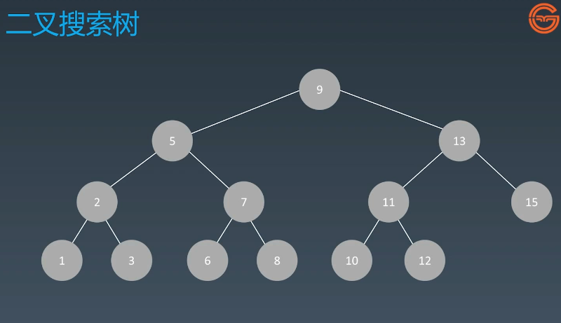

# 10、贪心算法

> 只找当前最优，不再进行回溯，不记录曾经走过的路；可能达不到最优解，但如果可以使用贪心算法得到最优结果，则贪心算法的探索过程一定是最优的，因为其没有额外的内存消耗，且时间方面也是最优的。

问题的关键是什么情况下可以使用贪心算法？

1、

2、

## 课后作业

#### [860. 柠檬水找零](https://leetcode-cn.com/problems/lemonade-change/)

> 贪心就在于：面对20元找零时，优先用掉10元面额的，逗人呢？

```java
Map<Integer, Integer> map = new HashMap<>();

    public boolean lemonadeChange(int[] bills) {
        if(bills == null || bills.length == 0) {
            return true;
        }
        map.put(5, 0);
        map.put(10, 0);
        map.put(20, 0);

        //模拟付账
        for (int i = 0; i < bills.length; i++) {
            int curPrice = bills[i];
            int returnCount = 0;

            map.put(curPrice, map.get(curPrice)+1);
            if(curPrice == 10) {
                if(map.get(5) == 0) {
                    return false;
                }
                map.put(5, map.get(5)-1);
            } else { //curPrice == 20
                if(map.get(10) > 0 && map.get(5) > 0) { // 1.第一种能通过的情况
                    map.put(10,map.get(10)-1);
                    map.put(5,map.get(5)-1);
                } else if(map.get(10) == 0 && map.get(5) >= 3) { //2. 第二种能通过的情况
                    map.put(5,map.get(5)-3);
                } else { // 通不过的情况
                    return false;
                }
            }
        }
}
```


#### [122. 买卖股票的最佳时机 II](https://leetcode-cn.com/problems/best-time-to-buy-and-sell-stock-ii/)

思路：

只要后者比前者大，则有利润，

```java
/最大利润：
    public int maxProfit(int[] prices) {
        if (prices == null) return 0;
        int profit = 0;
        for (int i = 1; i < prices.length; i++) {
            if(prices[i] > prices[i-1]) {
                profit += prices[i] - prices[i-1];
            }
        }
        return profit;
}
```


#### [455. 分发饼干](https://leetcode-cn.com/problems/assign-cookies/)

思路：1、饼干满足最小需求；2、饼干和需求尽可能相近；

```java
public int findContentChildren(int[] g, int[] s) {
    if(g == null || g.length == 0 || s == null || s.length == 0) {
        return 0;
    }
    int gLen = g.length;
    int sLen = s.length;
    int i= 0;
    int j= 0;
    Arrays.sort(g);
    Arrays.sort(s);
    int count = 0;

    while (i < gLen && j < sLen) {
        if(g[i] <= s[j]) {
            count++;
            i++;
            j++;
        } else {
            j++;
        }
    }
    return count;
}
```


#### [874. 模拟行走机器人](https://leetcode-cn.com/problems/walking-robot-simulation/)

```java
public int robotSim(int[] commands, int[][] obstacles) {
        if(commands == null || commands.length == 0) {
            return  0;
        }
        int result = 0;
        int x = 0,y = 0,direction = 0;  //x，y代表当前坐标
        int[][] xy = {{0, 1}, {1, 0}, {0, -1}, {-1, 0}};  //北移、东移、西移、南移

        //存储到set中进行判断
        Set<String> set = new HashSet<>();
        for (int[] array:obstacles) {
            set.add(array[0]+","+array[1]);
        }

        for (int com:commands) {
            if(com == -2) {
                // 左转
                direction = (direction+3)%4; //相当于右转了三次
            } else if(com == -1) {
                // 右转
                direction = (direction+1)%4;
            } else {
                //在指定方向前进com步
                for (int i = 1; i <= com; i++) {
                    int newX = x+xy[direction][0];
                    int newY = y+xy[direction][1];
                    //判断是否是障碍物
                    if(set.contains(newX+","+newY)) {
                        break;
                    }
                    //没有障碍物
                    x = newX;
                    y = newY;
                    result = Math.max(result,x*x+y*y);
                }
            }
        }
        return result;
}
```


#### [55. 跳跃游戏](https://leetcode-cn.com/problems/jump-game/)

思路：如何判断某一个位置可以达到？

在每个节点处最远可到达下标为：当前下标 i + nums[i]

怎么能到达 j 下标？ j <= 最远可到达的位置

```java
public boolean canJump(int[] nums) {
        if(nums == null || nums.length == 0) {
            return false;
        }
        int len = nums.length;
        int maxGet = 0;
        for (int i = 0; i < len; i++) {
            if(i <= maxGet) {
                //能够到达
                maxGet = Math.max(maxGet, i+nums[i]);
            } else {
                return false;
            }
        }
        return true;
}
```

#### [45. 跳跃游戏 II](https://leetcode-cn.com/problems/jump-game-ii/)

```java
//反向查找，查找第一个离终点最近的点
public int jump(int[] nums) {
    if(nums == null || nums.length == 0) {
        return 0;
    }
    int end = nums.length-1;
    int step = 0;

    while (end > 0) {
        for (int i = 0; i < end; i++) {
            if (i + nums[i] >= end) {
                end = i;
                step++;
                break;
            }
        }
    }
    return step;
}
```


```java
//正向贪心查找
public int jump1(int[] nums) {
    if(nums == null || nums.length == 0) {
        return 0;
    }
    int step = 0;
    int locMax = 0;
    int end = 0;  //记录当前边界


    //作用：探索当前能够达到的最大
    for (int i = 0; i < nums.length-1; i++) {
        locMax = Math.max(locMax, i+nums[i]);
        if(i == end) { //到达边界
            step++;
            end = locMax;  //新边界变为当前能够到达的最远
        }
    }
    return step;
}
```


## 参考链接

- [coin change 题目](https://leetcode-cn.com/problems/coin-change/)
- [动态规划定义](https://zh.wikipedia.org/wiki/动态规划)


# 11、二分查找

## 实战题目

#### [69. x 的平方根](https://leetcode-cn.com/problems/sqrtx/)

- 暴力求解

```
public int mySqrt(int x) {
        int i = x / 2 +1;
        for (long j = 0; j <= i; j++) {
            if(j*j == x) {
                //找到了
                return (int)j;
            } else if(j*j > x) {
                return (int)j-1;
            }
        }
        return -1;
}
```

- 二分查找求解

```java
public int mySqrt1(int x) {
       if(x==0 || x==1) {
            return x;
       }
       int left = 1;
       int right = x/2;
       while (left < right) {
           int mid = left+(right-left)/2;
           if(mid*mid > x) {
                right = mid-1;
           } else {
               left = mid+1;
           }
       }
       return right;
}
```

- 牛顿迭代法

```java
int s;

    //牛顿迭代法
    public int mySqrt3(int x) {
        s = x;
        s=x;
        if(x==0) return 0;
        return ((int)(sqrts(x)));
    }

    public double sqrts(double x){
        double res = (x + s / x) / 2;
        if (res == x) {
            return x;
        } else {
            return sqrts(res);
        }
}
```

- 牛顿迭代法的优雅实现方式

```java
public int mySqrt4(int x) {
        long s = x;
        while (s*s > x) {
            s = (s+x/s)/2;
        }
        return (int)s;
}
```


#### [367. 有效的完全平方数](https://leetcode-cn.com/problems/valid-perfect-square/)

要注意Integer越界问题：mid*mid可能大于Integer.MAX_VALUE

```java
public boolean isPerfectSquare(int num) {
        if(num == 1) {
            return true;
        }
        int left = 1;
        int right = num/2;
        while (left <= right) {
            long mid = left + (right-left)/2;
            if(mid*mid == num) {
                return true;
            } else if(mid*mid > num) {
                right = (int)mid - 1;
            } else if(mid*mid < num) {
                left = (int)mid + 1;
            }
        }
        return false;
}
```

- 牛顿迭代法

```java
 public boolean isPerfectSquare(int num) {
    if (num < 2) return true;

    long x = num / 2;
    while (x * x > num) {
      x = (x + num / x) / 2;
    }
    return (x * x == num);
}
```


## 课后作业

#### [33. 搜索旋转排序数组](https://leetcode-cn.com/problems/search-in-rotated-sorted-array/)


#### [74. 搜索二维矩阵](https://leetcode-cn.com/problems/search-a-2d-matrix/)

#### [153. 寻找旋转排序数组中的最小值](https://leetcode-cn.com/problems/find-minimum-in-rotated-sorted-array/)


- 使用二分查找，寻找一个半有序数组 [4, 5, 6, 7, 0, 1, 2] 中间无序的地方
       说明：同学们可以将自己的思路、代码写在第 3 周的学习总结中

## 参考链接

- [二分查找代码模板](https://shimo.im/docs/hjQqRQkGgwd9g36J)
- [Fast InvSqrt() 扩展阅读](https://www.beyond3d.com/content/articles/8/)


# 12、动态规划

## 参考链接

- [递归代码模板](http://shimo.im/docs/DjqqGCT3xqDYwPyY/)
- [分治代码模板](http://shimo.im/docs/3xvghYh3JJPKwdvt/)
- [动态规划定义](https://en.wikipedia.org/wiki/Dynamic_programming)


最长公共子序列

## 参考链接

- [不同路径题目](https://leetcode-cn.com/problems/unique-paths/)
- [不同路径 2 题目](https://leetcode-cn.com/problems/unique-paths-ii/)
- [最长公共子序列题目](https://leetcode-cn.com/problems/longest-common-subsequence/)
- [MIT 动态规划课程最短路径算法](https://www.bilibili.com/video/av53233912?from=search&seid=2847395688604491997)


## 实战题目

- https://leetcode-cn.com/problems/climbing-stairs/description/
- https://leetcode-cn.com/problems/triangle/description/
- https://leetcode.com/problems/triangle/discuss/38735/Python-easy-to-understand-solutions-(top-down-bottom-up)
- https://leetcode-cn.com/problems/maximum-subarray/
- https://leetcode-cn.com/problems/maximum-product-subarray/description/
- [https://leetcode-cn.com/problems/coin-change/description/](https://leetcode.com/problems/coin-change/description/)


## 实战题目

- https://leetcode-cn.com/problems/climbing-stairs/description/
- https://leetcode-cn.com/problems/triangle/description/
- https://leetcode.com/problems/triangle/discuss/38735/Python-easy-to-understand-solutions-(top-down-bottom-up)
- https://leetcode-cn.com/problems/maximum-subarray/
- https://leetcode-cn.com/problems/maximum-product-subarray/description/
- [https://leetcode-cn.com/problems/coin-change/description/](https://leetcode.com/problems/coin-change/description/)


## 实战题目

- https://leetcode-cn.com/problems/house-robber/
- https://leetcode-cn.com/problems/house-robber-ii/description/
- https://leetcode-cn.com/problems/best-time-to-buy-and-sell-stock/#/description
- https://leetcode-cn.com/problems/best-time-to-buy-and-sell-stock-ii/
- https://leetcode-cn.com/problems/best-time-to-buy-and-sell-stock-iii/
- https://leetcode-cn.com/problems/best-time-to-buy-and-sell-stock-with-cooldown/
- https://leetcode-cn.com/problems/best-time-to-buy-and-sell-stock-iv/
- https://leetcode-cn.com/problems/best-time-to-buy-and-sell-stock-with-transaction-fee/
- https://leetcode-cn.com/problems/best-time-to-buy-and-sell-stock/solution/yi-ge-fang-fa-tuan-mie-6-dao-gu-piao-wen-ti-by-l-3/


## 高级 DP 实战题目

- https://leetcode-cn.com/problems/perfect-squares/
- [https://leetcode-cn.com/problems/edit-distance/ ](https://leetcode-cn.com/problems/edit-distance/)（重点）
- https://leetcode-cn.com/problems/jump-game/
- https://leetcode-cn.com/problems/jump-game-ii/
- https://leetcode-cn.com/problems/unique-paths/
- https://leetcode-cn.com/problems/unique-paths-ii/
- https://leetcode-cn.com/problems/unique-paths-iii/
- https://leetcode-cn.com/problems/coin-change/
- https://leetcode-cn.com/problems/coin-change-2/

**注意：请大家先消化前面的实战题目，高级 DP 的方法和题解会在课程后面解锁。**


## 课后作业

- https://leetcode-cn.com/problems/longest-valid-parentheses/
- https://leetcode-cn.com/problems/minimum-path-sum/
- https://leetcode-cn.com/problems/edit-distance/
- https://leetcode-cn.com/problems/decode-ways
- https://leetcode-cn.com/problems/maximal-square/
- https://leetcode-cn.com/problems/max-sum-of-rectangle-no-larger-than-k/
- https://leetcode-cn.com/problems/frog-jump/
- https://leetcode-cn.com/problems/split-array-largest-sum
- https://leetcode-cn.com/problems/student-attendance-record-ii/
- https://leetcode-cn.com/problems/task-scheduler/
- https://leetcode-cn.com/problems/palindromic-substrings/
- https://leetcode-cn.com/problems/minimum-window-substring/
- https://leetcode-cn.com/problems/burst-balloons/


# 13、字典树和并查集

树的定义：


二叉搜索树：



- 二叉搜索树中序遍历是有序的。

现实中的一个实际问题：根据词频进行推荐显示，用什么数据结构？**二叉搜索树便于搜索而不便于插入。**

在这里使用字典树（也称Trie树）

## 字典树（Trie树）


- 多叉树
- 根节点不存储字符，根节点存储去往每个字符的路径**（图示中的单词只是作示范，并非真正的存储效果）**
- 空间换时间
- 叶子节点才存储词频
- 

### 基本性质

1、节点本身不存储完整单词；

2、从根节点到某一节点，路径上经过的字符串连接起来，为该节点对应的字符串；

3、每个节点的所有子节点路径都不同；

4、节点可以存储额外的信息，如出现的频次，通过频次可以进行推荐信息


查询次数：等于单词有多少个字符

### 核心思想

1、Trie树的核心思想是空间换时间

2、利用字符串的公共前缀来降低查询时候的时间开销以达到提高效率的目的


## 参考链接

#### [102. 二叉树的层序遍历](https://leetcode-cn.com/problems/binary-tree-level-order-traversal/)


#### [208. 实现 Trie (前缀树)](https://leetcode-cn.com/problems/implement-trie-prefix-tree/)

- python版


- Java版

采用数组方式存储子Trie，

```java
class Trie {
    Trie[] children;
    Boolean isEnd;

    /** Initialize your data structure here. */
    public Trie() {
        children = new Trie[26];
        isEnd = false;
    }

    /** Inserts a word into the trie. */
    public void insert(String word) {
        Trie node = this;
        Integer len = word.length();

        for (int i = 0; i < len; i++) {
            char c = word.charAt(i);
            int index = c-'a';
            if(node.children[index] == null) {
                node.children[index] = new Trie();
            }
            node = node.children[index];
        }
        node.isEnd = true;
    }

    public Trie searchPrefix(String word) {
        //返回最终的那个node
        Trie node = this;
        Integer len = word.length();

        for (int i = 0; i < len; i++) {
            char c = word.charAt(i);
            int index = c-'a';
            if(node.children[index] != null) {
                node = node.children[index];
            } else {
                return null;
            }
        }
        return node;
    }

    /** Returns if the word is in the trie. */
    public boolean search(String word) {
        Trie node = searchPrefix(word);
        return  node!= null && node.isEnd;
    }

    /** Returns if there is any word in the trie that starts with the given prefix. */
    public boolean startsWith(String prefix) {
        return  searchPrefix(prefix)!= null;
    }
}
```


- 复杂版

```java
class Trie {

    Trie[] children;
    Boolean isEnd;

    /** Initialize your data structure here. */
    public Trie() {
        children = new Trie[26];
        isEnd = false;
    }

    /** Inserts a word into the trie. */
    public void insert(String word) {
        Trie node = this;
        Integer len = word.length();

        for (int i = 0; i < len; i++) {
            char c = word.charAt(i);
            int index = c-'a';
            if(node.children[index] == null) {
                node.children[index] = new Trie();
            }
            node = node.children[index];
        }
        node.isEnd = true;
    }

    /** Returns if the word is in the trie. */
    public boolean search(String word) {
        Trie node = this;
        Integer len = word.length();

        int index = -1;
        for (int i = 0; i < len; i++) {
            char c = word.charAt(i);
            index = c-'a';
            if(node.children[index] != null) {
                node = node.children[index];
            } else {
                return false;
            }
        }
        if(node.isEnd) {
            return true;
        }
        return false;
    }

    /** Returns if there is any word in the trie that starts with the given prefix. */
    public boolean startsWith(String prefix) {
        Trie node = this;
        Integer len = prefix.length();

        int index = -1;
        for (int i = 0; i < len; i++) {
            char c = prefix.charAt(i);
            index = c-'a';
            if(node.children[index] != null) {
                node = node.children[index];
            } else {
                return false;
            }
        }

        return true;
    }
}
```

- 使用map+结束字符

```java
class Trie {

    Map<Character, Trie> children;
    char end_of_word;

    /** Initialize your data structure here. */
    public Trie() {
        children = new HashMap();
        end_of_word = '#';
    }

    /** Inserts a word into the trie. */
    public void insert(String word) {
        Trie node = this;
        for (char c: word.toCharArray()) {
            if(node.children.get(c) == null) {
                node.children.put(c,new Trie());
            }
            node = node.children.get(c);
        }
        node.end_of_word = '@';

    }

    public Trie searchPrefix(String word) {
        Trie node = this;
        for (char c: word.toCharArray()) {
            if(node.children.get(c) == null) {
                return null;
            } else {
                node = node.children.get(c);
            }
        }
        return node;
    }


    /** Returns if the word is in the trie. */
    public boolean search(String word) {
        Trie node = searchPrefix(word);
        return  node!= null && node.end_of_word == '@';
    }

    /** Returns if there is any word in the trie that starts with the given prefix. */
    public boolean startsWith(String prefix) {
        return  searchPrefix(prefix)!= null;
    }
}
```


## 实战题目 / 课后作业

- https://leetcode-cn.com/problems/implement-trie-prefix-tree/#/description
- https://leetcode-cn.com/problems/word-search-ii/
- 分析单词搜索 2 用 Tire 树方式实现的时间复杂度，请同学们提交在第 6 周的学习总结中。


## 并查集

## 参考链接

- [岛屿数量](https://leetcode-cn.com/problems/number-of-islands/)
- [并查集代码模板](https://shimo.im/docs/ydPCH33xDhK9YwWR)

## 实战题目 / 课后作业

- https://leetcode-cn.com/problems/friend-circles
- https://leetcode-cn.com/problems/number-of-islands/
- https://leetcode-cn.com/problems/surrounded-regions/


# 14、高级搜索

## 参考链接

- [DFS 代码模板](http://shimo.im/docs/ddgwCccJQKxkrcTq/)
- [BFS 代码模板](http://shimo.im/docs/P8TqKHGKt3ytkYYd/)
- [AlphaZero Explained](https://nikcheerla.github.io/deeplearningschool/2018/01/01/AlphaZero-Explained/)
- [棋类复杂度](https://en.wikipedia.org/wiki/Game_complexity)


## 实战题目

- https://leetcode-cn.com/problems/climbing-stairs/
- https://leetcode-cn.com/problems/generate-parentheses/
- [https://leetcode-cn.com/problems/n-queens](https://leetcode-cn.com/problems/n-queens/)
- https://leetcode-cn.com/problems/valid-sudoku/description/
- https://leetcode-cn.com/problems/sudoku-solver/#/description


## 参考链接

- [A* 代码模板](https://shimo.im/docs/CXvjHyWhpQcxXjcw/)
- [相似度测量方法](https://dataaspirant.com/2015/04/11/five-most-popular-similarity-measures-implementation-in-python/)
- [二进制矩阵中的最短路径的      A* 解法](https://leetcode.com/problems/shortest-path-in-binary-matrix/discuss/313347/A*-search-in-Python)
- [8 puzzles 解法比较](https://zxi.mytechroad.com/blog/searching/8-puzzles-bidirectional-astar-vs-bidirectional-bfs/)

## 实战题目

- https://leetcode-cn.com/problems/shortest-path-in-binary-matrix/
- https://leetcode-cn.com/problems/sliding-puzzle/
- https://leetcode-cn.com/problems/sudoku-solver/


# 15、AVL树和红黑树

## 参考链接

- [平衡树](https://en.wikipedia.org/wiki/Self-balancing_binary_search_tree)


# 16、位运算

## 参考链接

- [如何从十进制转换为二进制](https://zh.wikihow.com/从十进制转换为二进制)


## 参考链接

- [N 皇后位运算代码示例](https://shimo.im/docs/rHTyt8hcpT6D9Tj8/)

## 实战题目 / 课后作业

- https://leetcode-cn.com/problems/number-of-1-bits/
- https://leetcode-cn.com/problems/power-of-two/
- https://leetcode-cn.com/problems/reverse-bits/
- https://leetcode-cn.com/problems/n-queens/description/
- https://leetcode-cn.com/problems/n-queens-ii/description/
- https://leetcode-cn.com/problems/counting-bits/description/


# 17、布隆过滤器与LRU缓存

## 参考链接

- [布隆过滤器的原理和实现](https://www.cnblogs.com/cpselvis/p/6265825.html)
- [使用布隆过滤器解决缓存击穿、垃圾邮件识别、集合判重](https://blog.csdn.net/tianyaleixiaowu/article/details/74721877)
- [布隆过滤器      Python 代码示例](https://shimo.im/docs/xKwrcwrDxRv3QpKG/)
- [布隆过滤器      Python 实现示例](https://www.geeksforgeeks.org/bloom-filters-introduction-and-python-implementation/)
- [高性能布隆过滤器 Python 实现示例](https://github.com/jhgg/pybloof)
- [布隆过滤器      Java 实现示例 1](https://github.com/lovasoa/bloomfilter/blob/master/src/main/java/BloomFilter.java)
- [布隆过滤器      Java 实现示例 2](https://github.com/Baqend/Orestes-Bloomfilter)


## 参考链接

- [Understanding the Meltdown exploit](https://www.sqlpassion.at/archive/2018/01/06/understanding-the-meltdown-exploit-in-my-own-simple-words/)
- [替换算法总揽](https://en.wikipedia.org/wiki/Cache_replacement_policies)
- [LRU Cache Python 代码示例](https://shimo.im/docs/tTxRkGwJpXG6WkGY/)

## 实战题目 / 课后作业

- https://leetcode-cn.com/problems/lru-cache/#/


# 18、排序算法

## 参考链接

- [十大经典排序算法](https://www.cnblogs.com/onepixel/p/7674659.html)
- [快速排序代码示例](https://shimo.im/docs/98KjvGwwGpTpYGKy/)
- [归并排序代码示例](https://shimo.im/docs/YqgG6vtdKwkXJkWx/)
- [堆排序代码示例](https://shimo.im/docs/6kRVHRphpgjHgCtx/)
- 直播课回顾: [https://pan.baidu.com/s/1sFuZ8GjDCXy5mPCNLZhHxw ](https://pan.baidu.com/s/1sFuZ8GjDCXy5mPCNLZhHxw)提取码: 2rdy

## 课后作业

用自己熟悉的编程语言，手写各种初级排序代码，提交到第 7 周学习总结中。


## 参考链接

- [十大经典排序算法](https://www.cnblogs.com/onepixel/p/7674659.html)
- [9 种经典排序算法可视化动画](https://www.bilibili.com/video/av25136272)
- [6 分钟看完 15 种排序算法动画展示](https://www.bilibili.com/video/av63851336)

## 实战题目 / 课后作业

- https://leetcode-cn.com/problems/relative-sort-array/
- https://leetcode-cn.com/problems/valid-anagram/
- https://leetcode-cn.com/problems/design-a-leaderboard/
- https://leetcode-cn.com/problems/merge-intervals/
- https://leetcode-cn.com/problems/reverse-pairs/


# 19、高级动态规划

## 参考链接

- [爬楼梯](https://leetcode-cn.com/problems/climbing-stairs/)
- [不同路径](https://leetcode-cn.com/problems/unique-paths/)
- [打家劫舍](https://leetcode-cn.com/problems/house-robber/)
- [最小路径和](https://leetcode-cn.com/problems/minimum-path-sum/)
- [股票买卖](https://leetcode-cn.com/problems/best-time-to-buy-and-sell-stock/)

## 课后作业

在第 8 周学习总结中，写出[不同路径 2 ](https://leetcode-cn.com/problems/unique-paths-ii/)这道题目的状态转移方程。


## 参考链接

- [爬楼梯](https://leetcode-cn.com/problems/climbing-stairs/)
- [使用最小花费爬楼梯](https://leetcode-cn.com/problems/min-cost-climbing-stairs/)
- [编辑距离](https://leetcode-cn.com/problems/edit-distance/)

## 课后作业

- https://leetcode-cn.com/problems/longest-increasing-subsequence/
- https://leetcode-cn.com/problems/decode-ways/
- https://leetcode-cn.com/problems/longest-valid-parentheses/
- https://leetcode-cn.com/problems/maximal-rectangle/
- https://leetcode-cn.com/problems/distinct-subsequences/
- https://leetcode-cn.com/problems/race-car/


# 20、字符串基础与引申

## 参考链接

- [不可变字符串](https://lemire.me/blog/2017/07/07/are-your-strings-immutable/)
- [Atoi 代码示例](https://shimo.im/docs/KkDKkpWxjjrJXdpY/)

## 字符串基础问题

- https://leetcode-cn.com/problems/to-lower-case/
- https://leetcode-cn.com/problems/length-of-last-word/
- https://leetcode-cn.com/problems/jewels-and-stones/
- https://leetcode-cn.com/problems/first-unique-character-in-a-string/
- https://leetcode-cn.com/problems/string-to-integer-atoi/

## 字符串操作问题

- https://leetcode-cn.com/problems/longest-common-prefix/description/
- https://leetcode-cn.com/problems/reverse-string
- https://leetcode-cn.com/problems/reverse-string-ii/
- https://leetcode-cn.com/problems/reverse-words-in-a-string/
- https://leetcode-cn.com/problems/reverse-words-in-a-string-iii/
- https://leetcode-cn.com/problems/reverse-only-letters/

## 异位词问题

- https://leetcode-cn.com/problems/valid-anagram/
- https://leetcode-cn.com/problems/group-anagrams/
- https://leetcode-cn.com/problems/find-all-anagrams-in-a-string/

## 回文串问题

- https://leetcode-cn.com/problems/valid-palindrome/
- https://leetcode-cn.com/problems/valid-palindrome-ii/
- https://leetcode-cn.com/problems/longest-palindromic-substring/

 


## 最长子串、子序列问题

- https://leetcode-cn.com/problems/longest-common-subsequence/
- https://leetcode-cn.com/problems/edit-distance/
- https://leetcode-cn.com/problems/longest-palindromic-substring/

## 字符串 +DP 问题

- https://leetcode-cn.com/problems/regular-expression-matching/
- https://leetcode-cn.com/problems/regular-expression-matching/solution/ji-yu-guan-fang-ti-jie-gen-xiang-xi-de-jiang-jie-b/
- https://leetcode-cn.com/problems/wildcard-matching/
- https://leetcode-cn.com/problems/distinct-subsequences/


## 参考链接

- [Boyer-Moore 算法](http://xn--https-ni33a/www.ruanyifeng.com/blog/2013/05/boyer-moore_string_search_algorithm.html)
- [Sunday 算法](https://blog.csdn.net/u012505432/article/details/52210975)
- [字符串匹配暴力法代码示例](https://shimo.im/docs/dQDxQW8yXPXxh3Hg/)
- [Rabin-Karp 代码示例](https://shimo.im/docs/KXDdkT99TVtXvTXP/)
- [KMP 字符串匹配算法视频](https://www.bilibili.com/video/av11866460?from=search&seid=17425875345653862171)
- [字符串匹配的      KMP 算法](http://www.ruanyifeng.com/blog/2013/05/Knuth–Morris–Pratt_algorithm.html)

## 课后作业

- https://leetcode-cn.com/problems/first-unique-character-in-a-string/
- https://leetcode-cn.com/problems/string-to-integer-atoi/
- https://leetcode-cn.com/problems/reverse-string-ii/
- https://leetcode-cn.com/problems/reverse-words-in-a-string/
- https://leetcode-cn.com/problems/reverse-words-in-a-string-iii/
- https://leetcode-cn.com/problems/reverse-only-letters/
- https://leetcode-cn.com/problems/find-all-anagrams-in-a-string/
- https://leetcode-cn.com/problems/longest-palindromic-substring/
- https://leetcode-cn.com/problems/isomorphic-strings/
- https://leetcode-cn.com/problems/valid-palindrome-ii/
- https://leetcode-cn.com/problems/wildcard-matching
- https://leetcode-cn.com/problems/longest-valid-parentheses
- https://leetcode-cn.com/problems/distinct-subsequences/

 